# singleCellNet

### Introduction
See [CellNet](https://github.com/pcahan1/CellNet) for an introduction to CellNet, how to use it on bulk RNA-Seq, and how to analyze single cell RNA-Seq (scRNA-Seq) data with classifiers trained on bulk RNA-Seq. Here, we illustrate

- how to build and assess single cell classifiers 

- how to build and assess cross-species single cell classifiers

- how to use these classifiers to quantify 'cell identity' from query scRNA-Seq data

- how to cluster scRNA-Seq data using our 'cluster by competition' method

### DATA

In this example, we use a subset of the Tabula Muris data to train singleCellNet. To learn more about the Tabula Muris project, see the [manuscript])(https://www.biorxiv.org/content/early/2018/03/29/237446). As query data, we use scRNA-Seq of kidney cells as reported in [Park et al 2018](https://www.ncbi.nlm.nih.gov/pubmed/29622724). We also provide an example of classifying human, bead enriched PBMCs (from https://www.ncbi.nlm.nih.gov/pubmed/28091601). You can download this data here:

| APPLICATION | METADATA | EXPRESSION |
|-------------|----------|------------|
| Query       | [metadata](https://s3.amazonaws.com/cnobjects/singleCellNet/examples/sampTab_Park_MouseKidney_062118.rda) | [expression data](https://s3.amazonaws.com/cnobjects/singleCellNet/examples/expDat_Park_MouseKidney_062218.rda") |
| Training    | [metadata](https://s3.amazonaws.com/cnobjects/singleCellNet/examples/sampTab_TM_053018.rda) | [expression data](https://s3.amazonaws.com/cnobjects/singleCellNet/examples/expTM_Raw_053018.rda) |
| cross-species | [human-mouse orthologs](https://s3.amazonaws.com/cnobjects/singleCellNet/examples/human_mouse_genes_Jul_24_2018.rda)| Query (human bead-purified PBMC from 10x) | [metadata](https://s3.amazonaws.com/cnobjects/singleCellNet/examples/stDat_beads_mar22.rda) | [expression data](https://s3.amazonaws.com/cnobjects/singleCellNet/examples/6k_beadpurfied_raw.rda) |

#### Setup
```R
library(fgsea)
library(devtools)
install_github("pcahan1/singleCellNet", ref="tsp_rf_pc", auth="your_token")
library(singleCellNet)

library(RColorBrewer)
library(pheatmap)
library(randomForest)
library(viridis)
library(ggplot2)
library(dplyr)


mydate<-utils_myDate()
```

#### Fetch the data if you have not already done so
```R
download.file("https://s3.amazonaws.com/cnobjects/singleCellNet/examples/sampTab_Park_MouseKidney_062118.rda", "sampTab_Park_MouseKidney_062118.rda")

download.file("https://s3.amazonaws.com/cnobjects/singleCellNet/examples/expDat_Park_MouseKidney_062218.rda", "expDat_Park_MouseKidney_062218.rda")

download.file("https://s3.amazonaws.com/cnobjects/singleCellNet/examples/expTM_Raw_053018.rda", "expTM_Raw_053018.rda")

download.file("https://s3.amazonaws.com/cnobjects/singleCellNet/examples/sampTab_TM_053018.rda", "sampTab_TM_053018.rda")

## For cross-species analyis:
download.file("https://s3.amazonaws.com/cnobjects/singleCellNet/examples/human_mouse_genes_Jul_24_2018.rda", "human_mouse_genes_Jul_24_2018.rda")

download.file("https://s3.amazonaws.com/cnobjects/singleCellNet/examples/6k_beadpurfied_raw.rda", "6k_beadpurfied_raw.rda")

download.file("https://s3.amazonaws.com/cnobjects/singleCellNet/examples/stDat_beads_mar22.rda", "stDat_beads_mar22.rda")

```

#### Load query data
```R
stPark<-utils_loadObject("sampTab_Park_MouseKidney_062118.rda")
expPark<-utils_loadObject("expDat_Park_MouseKidney_062218.rda")
dim(expPark)
[1] 16272 43745

genesPark<-rownames(expPark)
```

#### Load the training data
```R
expTMraw<-utils_loadObject("expTM_Raw_053018.rda")
dim(expTMraw)
[1] 23433 24936

stTM<-utils_loadObject("sampTab_TM_053018.rda")
dim(stTM)
[1] 24936    17

stTM<-droplevels(stTM)
```

#### Find genes in common to the data sets
```R
commonGenes<-intersect(rownames(expTMraw), genesPark)
length(commonGenes)
[1] 13831
```

#### Normalize the training data
```R
expTMnorm<-trans_prop(weighted_down(expTMraw[commonGenes,], 1.5e3, dThresh=0.25), 1e4)
```

#### Find the best set of classifier genes
```R
stList<-splitCommon(stTM, ncells=100, dLevel="newAnn")
stTrain<-stList[[1]]
expTrain<-expTMnorm[,rownames(stTrain)]

system.time(cgenes2<-findClassyGenes(expTrain, stTrain, "newAnn", topX=10))
   user  system elapsed 
 92.374  19.027 111.651 

cgenesA<-cgenes2[['cgenes']]
grps<-cgenes2[['grps']]
length(cgenesA)
[1] 481

# heatmap these genes
hm_gpa_sel(expTrain, cgenesA, grps, maxPerGrp=5, toScale=T, cRow=F, cCol=F,font=4)
```
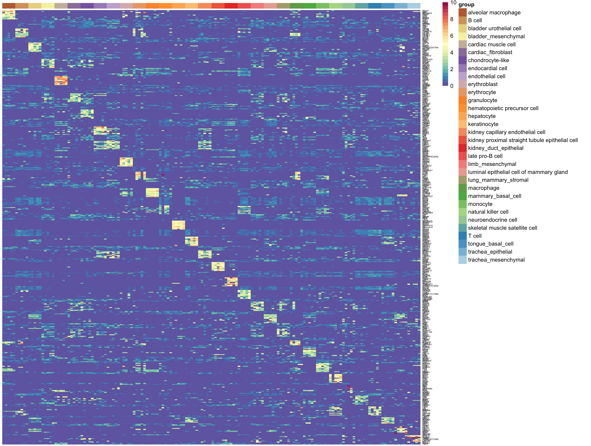

####  Find the best pairs
 ```R
 system.time(xpairs<-ptGetTop(expTrain[cgenesA,], grps, topX=50, sliceSize=100))
   user   system  elapsed 
1020.057  375.750 1396.290

length(xpairs)
[1] 1547
```

#### TSP transform the training data
```R
system.time(pdTrain<-query_transform(expTrain[cgenesA, ], xpairs))
  user  system elapsed 
  0.352   0.061   0.414 

dim(pdTrain)
[1] 1547 3036

 ```


#### Train the classifier
```R
system.time(rf_tspAll<-sc_makeClassifier(pdTrain[xpairs,], genes=xpairs, groups=grps, nRand=100, ntrees=1000))       user  system elapsed 
560.335   0.884 561.432
```

#### Apply to held out data -- this is the place to add the multi-class assessment
```R
stTest<-stList[[2]]

system.time(expQtransAll<-query_transform(expTMraw[cgenesA,rownames(stTest)], xpairs))
 
    user  system elapsed 
  4.221   2.751  11.369 


nrand<-100
system.time(classRes_val_all<-rf_classPredict(rf_tspAll, expQtransAll, numRand=nrand))
  user  system elapsed 
 37.136   1.522  38.691 

sla<-as.vector(stTest$newAnn)
names(sla)<-rownames(stTest)
slaRand<-rep("rand", nrand)
names(slaRand)<-paste("rand_", 1:nrand, sep='')

sla<-append(sla, slaRand)

# heatmap classification result
sc_hmClass(classRes_val_all, sla, max=300, isBig=TRUE)
```
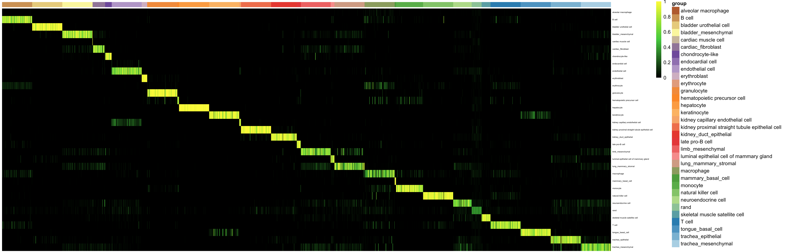

#### Apply to Park et al query data
```R
system.time(kidTransAll<-query_transform(expPark[cgenesA,], xpairs))
   user  system elapsed 
  8.594   3.314  15.704 
  
nqRand<-100

system.time(crParkall<-rf_classPredict(rf_tspAll, kidTransAll, numRand=nqRand))
  user  system elapsed 
 78.520   3.873  82.49

sgrp<-as.vector(stPark$description1)
names(sgrp)<-rownames(stPark)
grpRand<-rep("rand", nqRand)
names(grpRand)<-paste("rand_", 1:nqRand, sep='')
sgrp<-append(sgrp, grpRand)

# heatmap classification result
sc_hmClass(crParkall, sgrp, max=5000, isBig=TRUE, cCol=F, font=8)
```
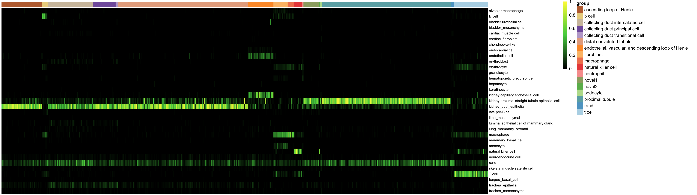


### Skyline plot of classification results
```R
stKid2<-addRandToSampTab(crParkall, stPark, "description1", "sample_name")
skylineClass(crParkall, "T cell", stKid2, "description1",.25, "sample_name")
```
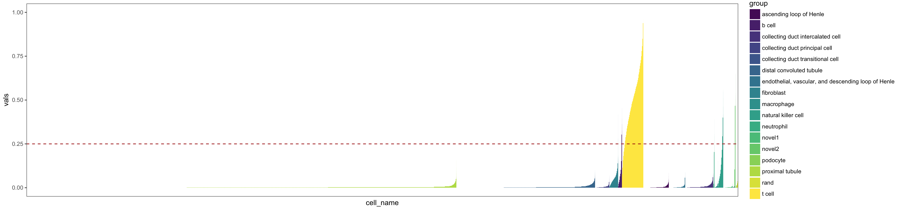


#### Determine cell groups yourself using Cluster by Competition (CBC)
```R
library(cluster)
library(pcaMethods)
library(rpca)
library(data.tree)
library(dbscan)
library(Rtsne)

gstats<-sc_statTab(expTrain, dThresh=1)
ggenes<-sc_filterGenes(gstats, alpha1=0.025, alpha2=.001, mu=2)
length(ggenes)
[1] 7777

system.time(xTree_auto<-gpa_recurse(expTrain[ggenes,], zThresh=2, maxLevel=3, nPCs=2, SilhDrop=0.5, methods=c("cutree","sNN_clust","kmeans"), dThresh=1, pcaMethod="prcomp",k=2:8, minClusterSize=20, silMin=FALSE, pcAuto=TRUE))

   user  system elapsed 
 77.129   4.513  81.654 

system.time(ts3<-pca_to_tsne(expTrain[ggenes,], xTree_auto, perplexity=30, theta=0.25, weighted=FALSE))
 user  system elapsed 
 44.945   0.410  45.370


stT1<-stTrain
stT1<-cbind(stT1, cluster=xTree_auto$groups)
sampTab<-cbind(sampTab, cluster2=xTree_auto$grp_list[[2]])
sampTab<-cbind(sampTab, cluster3=xTree_auto$grp_list[[3]])

plot_tsne(stT1, ts3, cname="cluster")
```
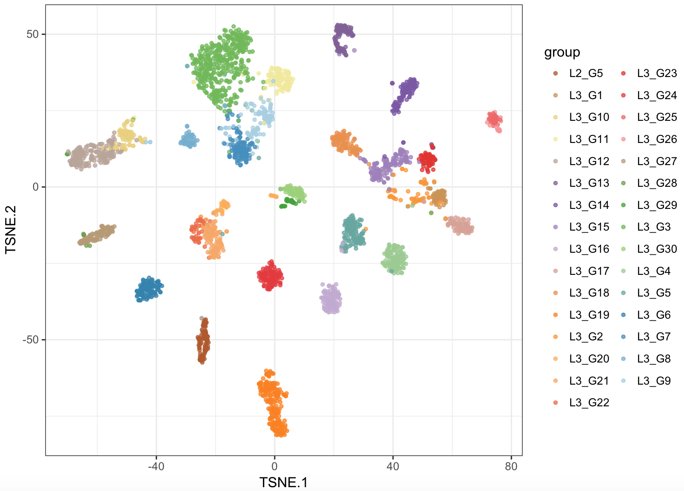

#### Black background; good for presentations
```R
plot_tsne(stT1, ts3, cname="cluster", themeWhite=FALSE)
```
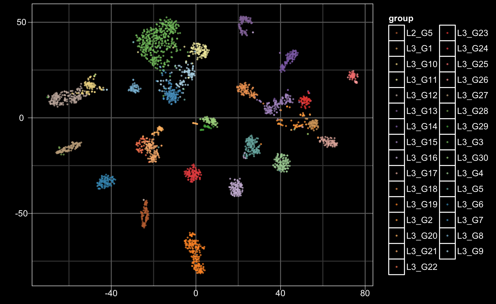


Color by category provided by Tabula Muris
```R
plot_tsne(stT1, ts3, cname="newAnn")
```
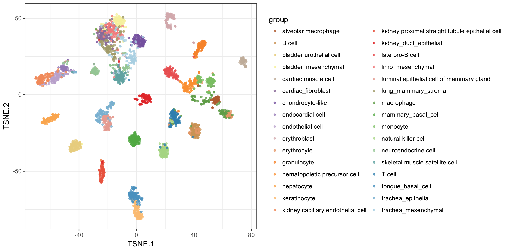

 
#### Differential expression
```R
system.time(xdiff<-gnrAll(expTrain[ggenes,], xTree_auto$groups))
   user  system elapsed 
 71.072  16.591  87.684 

x1<-lapply( xdiff, getTopGenes, 5)
newOrder<-reorderCellsByGrp( xTree_auto$groups , names(x1))

hm_gpa_sel(expTrain, c(unique(unlist(x1))), newOrder, maxPerGrp=20, toScale=T, cRow=F, cCol=F,font=5)
```


#### tsne plot specific genes 
```R 
tsneMultsimp(ts3, expTrain, c("Ear2","Tnnt2","Cd3e","Apoc3"))
```
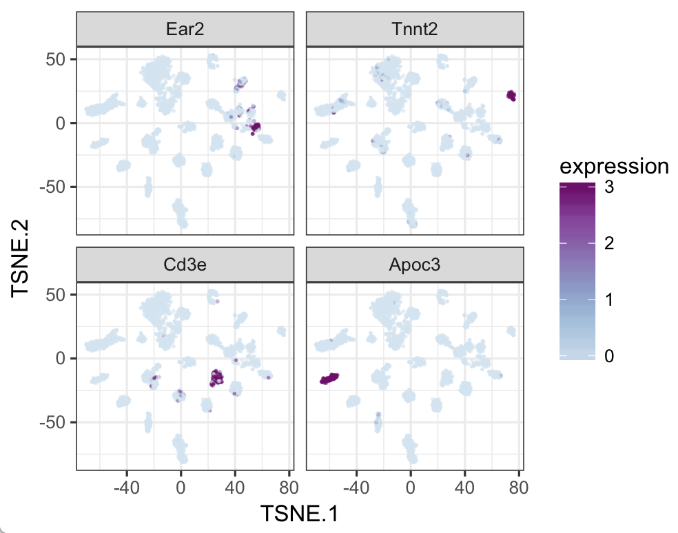

#### tsne plot specific genes; black background
```R 
tsneMultsimp(ts3, expTrain, c("Ear2","Tnnt2","Cd3e","Apoc3"), revCol=FALSE,themeWhite=FALSE)
```
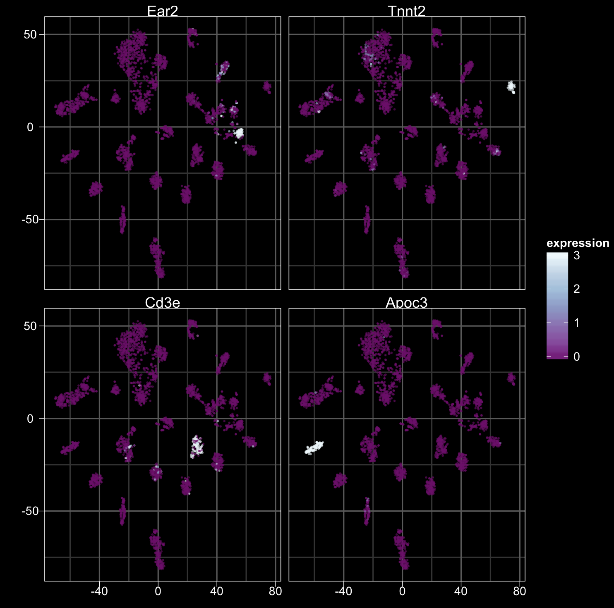

#### Gene set enrichment analysis

Download and install fgsea (https://github.com/ctlab/fgsea) if you don't already have it
```R
install_github("ctlab/fgsea")
```

Enrichment analysis
```R
# download mouse symbol hallmarks gene sets
download.file("https://s3.amazonaws.com/cnobjects/singleCellNet/resources/mouse_symbols_H_v5p2_Dec_11_2017.rda")

gsHallmarks<-utils_loadObject("mouse_symbols_H_v5p2_Dec_11_2017.rda")

# limit to genes included in both the expression data and in the hallmarks lists
gsHall<-lapply(gsHallmarks, intersect, rownames(xdiff[[1]]))

system.time(enrPatt<-fgsea.wrapper.set(xdiff, gsHall, minSize=20, nPerm=1e3))
  user  system elapsed 
 34.546   0.814   6.781 

esMatPat<-ks.extract.more(enrPatt, sigThresh=1.1, sigType='padj', gsColName='pathway', esColName='NES')

# heatmap the enrichment scores, color only those that are significant
hm_enr(esMatPat, 0.05, cRows=T, cCols=T, fsr=6)
```
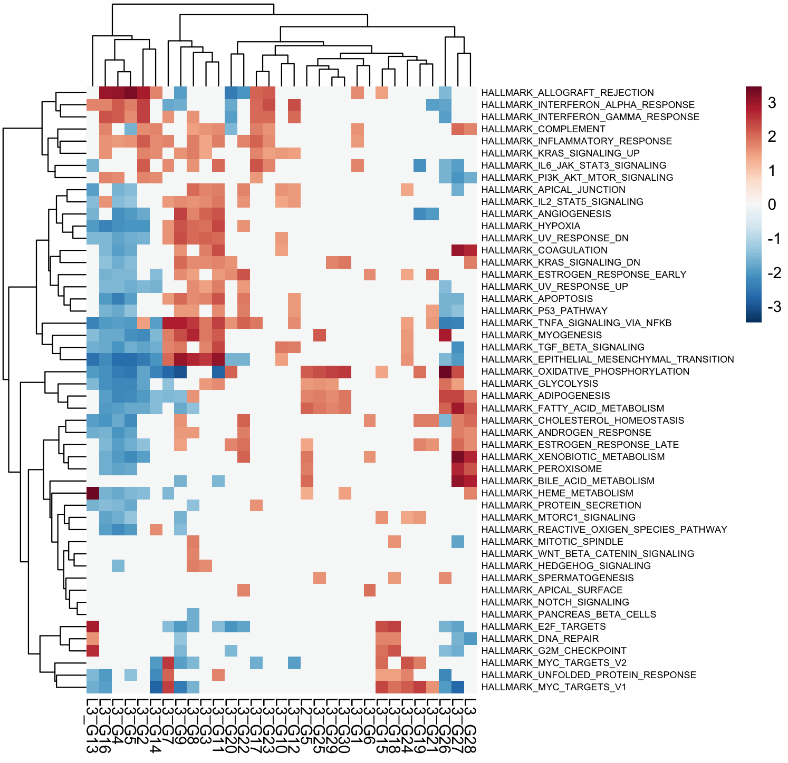

### Cross-species classification

Load the human query data
```R
stQuery<-utils_loadObject("stDat_beads_mar22.rda")
expQuery<-utils_loadObject("6k_beadpurfied_raw.rda")
dim(expQuery)
[1] 32643  6000
```

Load the ortholog table and convert human gene names to mouse ortholog names, and limit analysis to genes in common between the training and query data.
```R
oTab<-utils_loadObject("human_mouse_genes_Jul_24_2018.rda")
dim(oTab)
[1] 16688     3

aa = csRenameOrth(expQuery, expRawTM, oTab)
expQuery <- aa[['expQuery']]
expTrain <- aa[['expTrain']]
```

Limit anlaysis to a subset of the TM cell types
```R
cts<-c("B cell",  "cardiac muscle cell", "endothelial cell", "erythroblast", "granulocyte", "hematopoietic precursor cell", "late pro-B cell", "limb_mesenchymal", "macrophage", "mammary_basal_cell", "monocyte", "natural killer cell", "T cell", "trachea_epithelial", "trachea_mesenchymal")

stTM2<-filter(stTM, newAnn %in% cts)
stTM2<-droplevels(stTM2)
rownames(stTM2)<-as.vector(stTM2$cell) # filter strips rownames

expTrain<-expTrain[,rownames(stTM2)]
dim(expTrain)
[1] 14550 15161
```

Normalize training data. Split into trainin and validation, and find classy genes
```R
expTMnorm<-trans_prop(weighted_down(expTrain, 1.5e3, dThresh=0.25), 1e4)

stList<-splitCommon(stTM2, ncells=100, dLevel="newAnn")
stTrain<-stList[[1]]
dim(stTrain)
[1]  1457  17


expTrainSS<-expTMnorm[,rownames(stTrain)]

system.time(cgenes2<-findClassyGenes(expTrainSS, stTrain, "newAnn", topX=30))
   user  system elapsed 
 10.610   1.332  11.941

cgenesA<-cgenes2[['cgenes']]
grps<-cgenes2[['grps']]
length(cgenesA)
[1] 650
```

find best pairs and transform query data, and train classifier
```R
system.time(xpairs<-ptGetTop(expTrainSS[cgenesA,], grps, topX=75, sliceSize=5000))
nPairs =  210925
  user  system elapsed 
597.289 169.932 767.181


pdTrain<-query_transform(expTrainSS[cgenesA, ], xpairs)

system.time(rf_tspAll<-sc_makeClassifier(pdTrain[xpairs,], genes=xpairs, groups=grps, nRand=50, ntrees=1000))
   user  system elapsed 
 59.171   0.122  59.285
 ```

Apply to held out data
```R
stTest<-stList[[2]]

system.time(expQtransAll<-query_transform(expRawTM[cgenesA,rownames(stTest)], xpairs))
   user  system elapsed 
  1.294   0.240   1.534 

nrand<-50
system.time(classRes_val_all<-rf_classPredict(rf_tspAll, expQtransAll, numRand=nrand))
  user  system elapsed 
 13.356   0.723  14.078 


sla<-as.vector(stTest$newAnn)
names(sla)<-rownames(stTest)
slaRand<-rep("rand", nrand)
names(slaRand)<-paste("rand_", 1:nrand, sep='')

sla<-append(sla, slaRand)

# heatmap classification result
sc_hmClass(classRes_val_all, sla, max=300, font=7, isBig=TRUE)
```
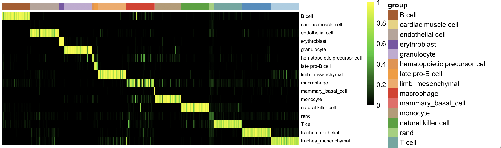

@YT: Add the PR -> AUPR assessment here

Apply to human query data
```R
system.time(expQueryTrans<-query_transform(expQuery[cgenesA,], xpairs))
  user  system elapsed 
  0.519   0.074   0.593
  
nqRand<-50
system.time(crHS<-rf_classPredict(rf_tspAll, expQueryTrans, numRand=nqRand))
   user  system elapsed 
  5.941   0.222   6.162 

# heatmap classification result
sgrp<-as.vector(stQuery$prefix)
names(sgrp)<-rownames(stQuery)
grpRand<-rep("rand", nqRand)
names(grpRand)<-paste("rand_", 1:nqRand, sep='')
sgrp<-append(sgrp, grpRand)
sc_hmClass(crHS, sgrp, max=5000, isBig=TRUE, cCol=F, font=8)
```
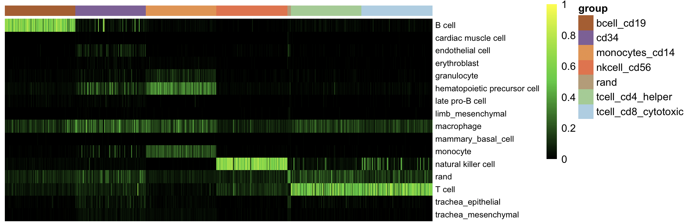

Note that the macrophage category seems to be promiscuous in the mouse held out data, too.


