# singleCellNet

### Introduction
SingleCellNet enables the classifcation of single cell RNA-Seq data across species and platforms. See [BioRxiv](https://www.biorxiv.org/content/early/2018/12/31/508085) for details. 

Here, we illustrate ... 

- how to build and assess single cell classifiers 

- how to build and assess cross-species single cell classifiers

- how to use these classifiers to quantify 'cell identity' from query scRNA-Seq data

If you want to use the bulk RNA-Seq version of CellNet, go to [bulk CellNet](https://github.com/pcahan1/CellNet). 


### DATA

In this example, we use a subset of the Tabula Muris data to train singleCellNet. To learn more about the Tabula Muris project, see the [manuscript](https://www.biorxiv.org/content/early/2018/03/29/237446). As query data, we use scRNA-Seq of kidney cells as reported in [Park et al 2018](https://www.ncbi.nlm.nih.gov/pubmed/29622724). We also provide an example of classifying human, bead enriched PBMCs (from https://www.ncbi.nlm.nih.gov/pubmed/28091601). You can download this data here:

| APPLICATION | METADATA | EXPRESSION |
|-------------|----------|------------|
| Query       | [metadata](https://s3.amazonaws.com/cnobjects/singleCellNet/examples/sampTab_Park_MouseKidney_062118.rda) | [expression data](https://s3.amazonaws.com/cnobjects/singleCellNet/examples/expDat_Park_MouseKidney_062218.rda") |
| Training    | [metadata](https://s3.amazonaws.com/cnobjects/singleCellNet/examples/sampTab_TM_053018.rda) | [expression data](https://s3.amazonaws.com/cnobjects/singleCellNet/examples/expTM_Raw_053018.rda) |
| cross-species | [human-mouse orthologs](https://s3.amazonaws.com/cnobjects/singleCellNet/examples/human_mouse_genes_Jul_24_2018.rda)|           |
| cross-species | [metadata](https://s3.amazonaws.com/cnobjects/singleCellNet/examples/stDat_beads_mar22.rda) | [expression data](https://s3.amazonaws.com/cnobjects/singleCellNet/examples/6k_beadpurfied_raw.rda) |

More training datasets (metadata and expression data) are provided at the bottom of the page.

#### Setup
```R
install.packages("devtools")
library(devtools)
install_github("thomasp85/patchwork")
install_github("pcahan1/singleCellNet")
library(singleCellNet)
library(dplyr)

mydate<-utils_myDate()
```
#### Optional set up if you are working with loom files
```
devtools::install_github(repo = "hhoeflin/hdf5r")
devtools::install_github(repo = "mojaveazure/loomR", ref = "develop")
library(loomR)
```

#### Fetch the data if you have not already done so
```R
download.file("https://s3.amazonaws.com/cnobjects/singleCellNet/examples/sampTab_Park_MouseKidney_062118.rda", "sampTab_Park_MouseKidney_062118.rda")

download.file("https://s3.amazonaws.com/cnobjects/singleCellNet/examples/expMatrix_Park_MouseKidney_Oct_12_2018.rda", "expMatrix_Park_MouseKidney_Oct_12_2018.rda")

download.file("https://s3.amazonaws.com/cnobjects/singleCellNet/examples/expMatrix_TM_Raw_Oct_12_2018.rda", "expMatrix_TM_Raw_Oct_12_2018.rda")

download.file("https://s3.amazonaws.com/cnobjects/singleCellNet/examples/sampTab_TM_053018.rda", "sampTab_TM_053018.rda")

## For cross-species analyis:
download.file("https://s3.amazonaws.com/cnobjects/singleCellNet/examples/human_mouse_genes_Jul_24_2018.rda", "human_mouse_genes_Jul_24_2018.rda")

download.file("https://s3.amazonaws.com/cnobjects/singleCellNet/examples/6k_beadpurfied_raw.rda", "6k_beadpurfied_raw.rda")

download.file("https://s3.amazonaws.com/cnobjects/singleCellNet/examples/stDat_beads_mar22.rda", "stDat_beads_mar22.rda")

## To demonstrate how to integrate loom files to SCN
download.file("https://s3.amazonaws.com/cnobjects/singleCellNet/examples/pbmc_6k.loom", "pbmc_6k.loom")
```

#### Load query data
```R
stPark<-utils_loadObject("sampTab_Park_MouseKidney_062118.rda")
expPark<-utils_loadObject("expMatrix_Park_MouseKidney_Oct_12_2018.rda")
dim(expPark)
[1] 16272 43745

genesPark<-rownames(expPark)

rm(expPark)
gc()
```

#### Load the training data
```R
expTMraw<-utils_loadObject("expMatrix_TM_Raw_Oct_12_2018.rda")
dim(expTMraw)
[1] 23433 24936

stTM<-utils_loadObject("sampTab_TM_053018.rda")
dim(stTM)
[1] 24936    17

stTM<-droplevels(stTM)
```

#### Find genes in common to the data sets and limit analysis to these
```R
commonGenes<-intersect(rownames(expTMraw), genesPark)
length(commonGenes)
[1] 13831

expTMraw<-expTMraw[commonGenes,]
```

#### Split for training and assessment, and transform training data
```R
stList<-splitCommon(stTM, ncells=100, dLevel="newAnn")
stTrain<-stList[[1]]
expTrain<-expTMraw[,rownames(stTrain)]


system.time(tmpX<-weighted_down(expTrain, 1.5e3, dThresh=0.25))
   user  system elapsed 
  5.662   0.958   6.649 

system.time(expTrain<-trans_prop(tmpX, 1e4))
   user  system elapsed 
  2.033   0.888   2.925 
```

#### Find the best set of classifier genes
```R

system.time(cgenes2<-findClassyGenes(expTrain, stTrain, "newAnn", topX=10))
   user  system elapsed 
 51.145   7.603  59.067 

cgenesA<-cgenes2[['cgenes']]
grps<-cgenes2[['grps']]
length(cgenesA)
[1] 473

# heatmap these genes
hm_gpa_sel(expTrain, cgenesA, grps, maxPerGrp=5, toScale=T, cRow=F, cCol=F,font=4)
```
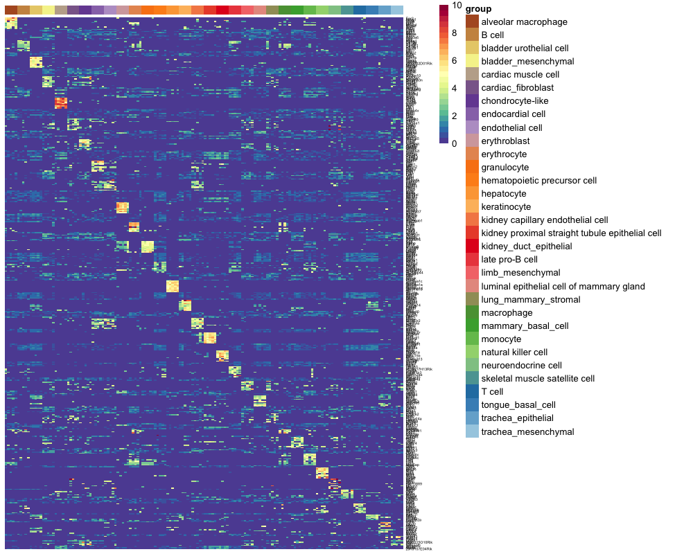

#### Find the best pairs
```R
expT<-as.matrix(expTrain[cgenesA,])
dim(expT)
[1]  473 3036

system.time(xpairs<-ptGetTop(expT, grps, topX=25, sliceSize=5000))
    user   system  elapsed 
1902.520 1189.397  803.201 

length(xpairs)
[1] 797
```

#### TSP transform the training data
```R
system.time(pdTrain<-query_transform(expT[cgenesA, ], xpairs))
   user  system elapsed 
  0.179   0.031   0.212 
  
dim(pdTrain)
[1]  797 3036

 ```

#### Train the classifier
```R
system.time(rf_tspAll<-sc_makeClassifier(pdTrain[xpairs,], genes=xpairs, groups=grps, nRand=100, ntrees=1000))
   user  system elapsed 
393.570   1.112 395.620 
```

#### Apply to held out data
```R
stTest<-stList[[2]]

system.time(expQtransAll<-query_transform(expTMraw[cgenesA,rownames(stTest)], xpairs))
   user  system elapsed 
 16.479   1.578  18.359 

nrand<-100
system.time(classRes_val_all<-rf_classPredict(rf_tspAll, expQtransAll, numRand=nrand))
   user  system elapsed 
 30.808   1.379  32.210 
```

#### Assess classifier
```R
tm_heldoutassessment <- assess_comm(ct_scores = classRes_val_all, stTrain = stTrain, stQuery = stTest, dLevelSID = "cell", classTrain = "newAnn", classQuery = "newAnn")
plot_PRs(tm_heldoutassessment)
```
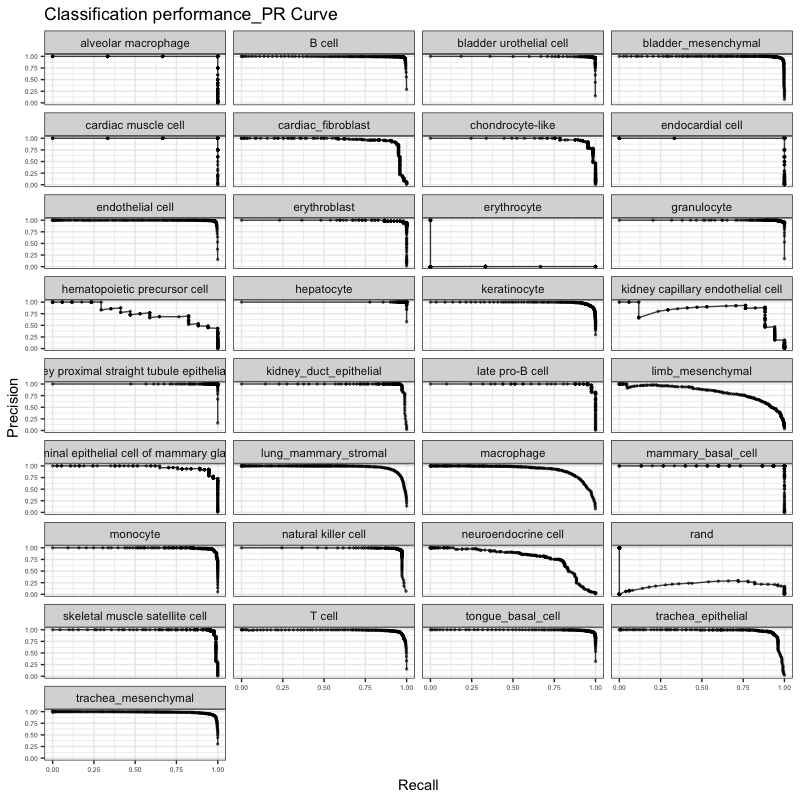

```R
plot_metrics(tm_heldoutassessment)
```
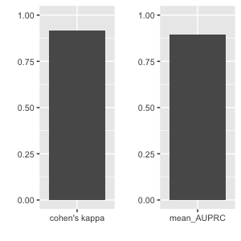

#### Classification result heatmap
```R
sla<-as.vector(stTest$newAnn)
names(sla)<-rownames(stTest)
slaRand<-rep("rand", nrand)
names(slaRand)<-paste("rand_", 1:nrand, sep='')
sla<-append(sla, slaRand)

sc_hmClass(classRes_val_all, sla, max=300, isBig=TRUE)
```
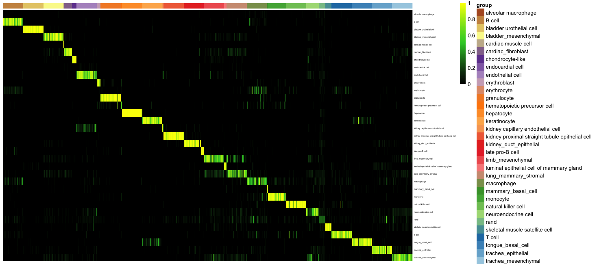

#### Attribution plot
```R
plot_attr(classRes_val_all, stTest, nrand=nrand, dLevel="newAnn", sid="cell")
```
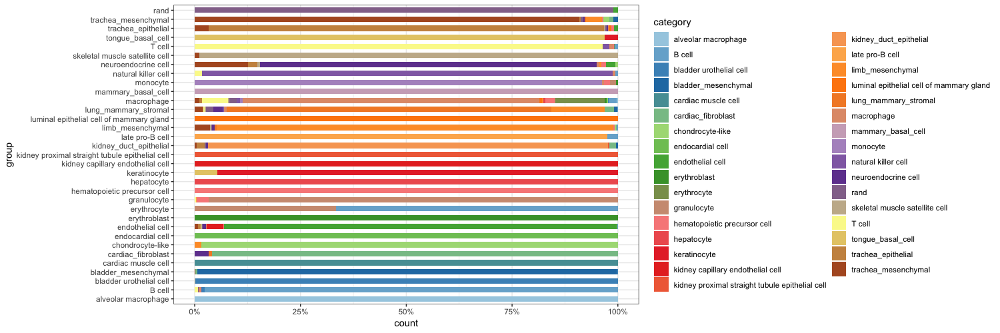


#### Apply to Park et al query data
```R
expPark<-utils_loadObject("expMatrix_Park_MouseKidney_Oct_12_2018.rda")
system.time(kidTransAll<-query_transform(expPark[cgenesA,], xpairs))
   user  system elapsed 
 23.536   1.721  25.338 
  
nqRand<-100
system.time(crParkall<-rf_classPredict(rf_tspAll, kidTransAll, numRand=nqRand))
   user  system elapsed 
 60.601   2.898  63.654 

sgrp<-as.vector(stPark$description1)
names(sgrp)<-rownames(stPark)
grpRand<-rep("rand", nqRand)
names(grpRand)<-paste("rand_", 1:nqRand, sep='')
sgrp<-append(sgrp, grpRand)

# heatmap classification result
sc_hmClass(crParkall, sgrp, max=5000, isBig=TRUE, cCol=F, font=8)
```
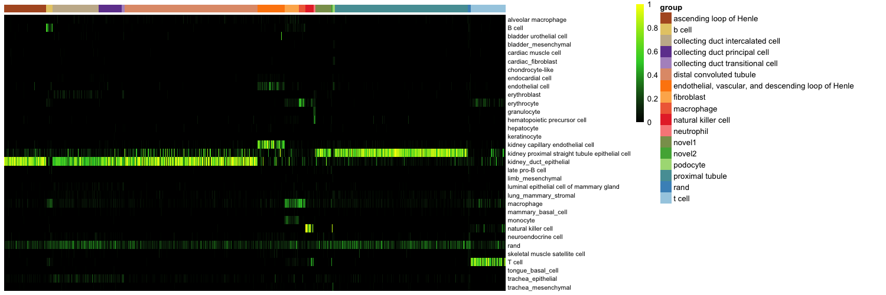

#### classification result violin plot
```R
sc_violinClass(sampTab = stPark, classRes = crParkall, cellIDCol = "sample_name", dLevel = "description1", addRand = nrand)
```
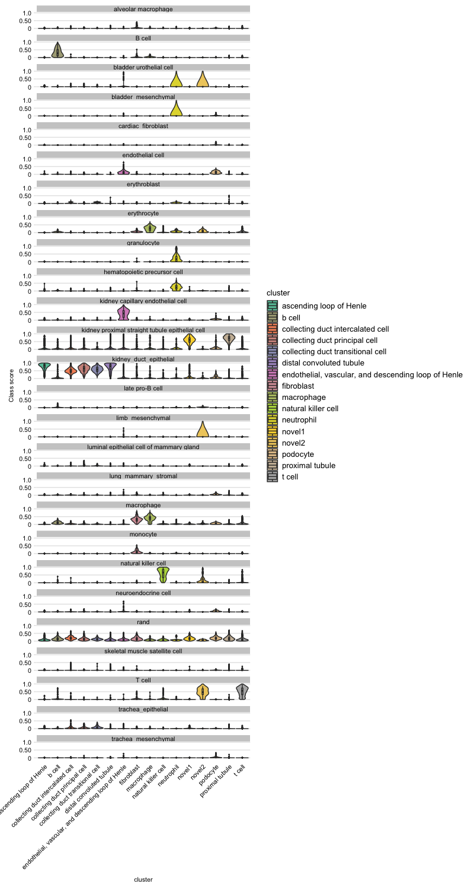

#### Skyline plot of classification results
```R
stKid2<-addRandToSampTab(crParkall, stPark, "description1", "sample_name")
skylineClass(crParkall, "T cell", stKid2, "description1",.25, "sample_name")
```


### Cross-species classification

#### Load the human query data
```R
stQuery<-utils_loadObject("stDat_beads_mar22.rda")
expQuery<-utils_loadObject("6k_beadpurfied_raw.rda") # use Matrix if RAM low
dim(expQuery)
[1] 32643  6000

stTM<-utils_loadObject("sampTab_TM_053018.rda")
expTMraw<-utils_loadObject("expMatrix_TM_Raw_Oct_12_2018.rda") # reload training

```

#### Load the ortholog table and convert human gene names to mouse ortholog names, and limit analysis to genes in common between the training and query data.
```R
oTab<-utils_loadObject("human_mouse_genes_Jul_24_2018.rda")
dim(oTab)
[1] 16688     3

aa = csRenameOrth(expQuery, expTMraw, oTab)
expQuery <- aa[['expQuery']]
expTrain <- aa[['expTrain']]
```

#### Limit anlaysis to a subset of the TM cell types
```R
cts<-c("B cell",  "cardiac muscle cell", "endothelial cell", "erythroblast", "granulocyte", "hematopoietic precursor cell", "late pro-B cell", "limb_mesenchymal", "macrophage", "mammary_basal_cell", "monocyte", "natural killer cell", "T cell", "trachea_epithelial", "trachea_mesenchymal")

stTM2<-filter(stTM, newAnn %in% cts)
stTM2<-droplevels(stTM2)
rownames(stTM2)<-as.vector(stTM2$cell) # filter strips rownames

expTrain<-expTrain[,rownames(stTM2)]
dim(expTrain)
[1] 14550 15161
```

#### Split into training and validation, normalize training data, and find classy genes
```R
stList<-splitCommon(stTM2, ncells=100, dLevel="newAnn")
stTrain<-stList[[1]]
dim(stTrain)
[1] 1457   17

expTrain<-trans_prop(weighted_down(expTrain[,rownames(stTrain)], 1.5e3, dThresh=0.25), 1e4)

system.time(cgenes2<-findClassyGenes(expTrain, stTrain, "newAnn", topX=10))
  user  system elapsed 
 16.888   3.499  20.506 


cgenesA<-cgenes2[['cgenes']]
grps<-cgenes2[['grps']]
length(cgenesA)
[1] 245

# heatmap these genes
hm_gpa_sel(expTrain, cgenesA, grps, maxPerGrp=20, toScale=T, cRow=F, cCol=F,font=4)
```
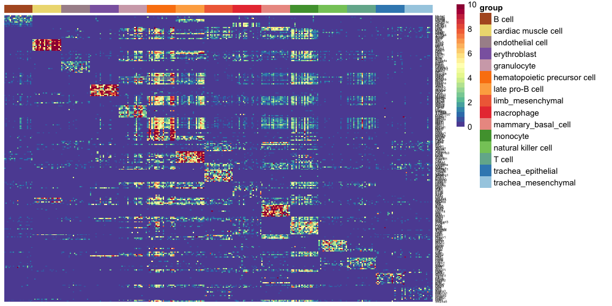


#### find best pairs and transform query data, and train classifier
```R
system.time(xpairs<-ptGetTop(expTrain[cgenesA,], grps, topX=25, sliceSize=5000))
   user  system elapsed 
185.198 142.132 163.631 

length(xpairs)
[1] 374

pdTrain<-query_transform(expTrain[cgenesA, rownames(stTrain)], xpairs)

dim(pdTrain)
[1]  374 1457

nrand = 50
system.time(rf_tspAll<-sc_makeClassifier(pdTrain[xpairs,], genes=xpairs, groups=grps, nRand=nrand, ntrees=1000))
  user  system elapsed 
 18.321   0.057  18.373
 ```

#### Apply to held out data
```R
stTest<-stList[[2]]

system.time(expQtransAll<-query_transform(expTMraw[cgenesA,rownames(stTest)], xpairs))
   user  system elapsed 
  3.055   0.375   3.489

system.time(classRes_val_all<-rf_classPredict(rf_tspAll, expQtransAll, numRand=nrand))
   user  system elapsed 
  7.055   0.254   7.311  
```

#### assess classifier
```R
tm_heldoutassessment <- assess_comm(ct_scores = classRes_val_all, stTrain = stTrain, stQuery = stTest, dLevelSID = "cell", classTrain = "newAnn", classQuery = "newAnn")
plot_PRs(tm_heldoutassessment)
```
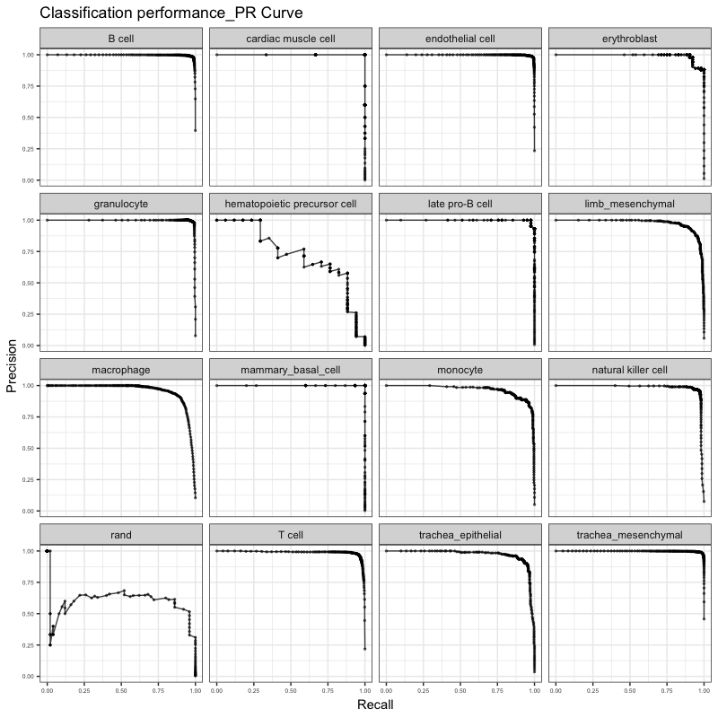

```R
plot_metrics(tm_heldoutassessment)
```
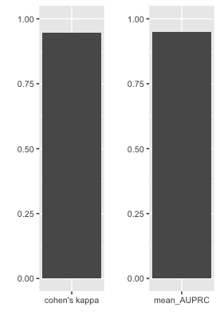

#### Classification result heatmap
```R
sla<-as.vector(stTest$newAnn)
names(sla)<-rownames(stTest)
slaRand<-rep("rand", nrand)
names(slaRand)<-paste("rand_", 1:nrand, sep='')
sla<-append(sla, slaRand)

# heatmap classification result
sc_hmClass(classRes_val_all, sla, max=300, font=7, isBig=TRUE)
```
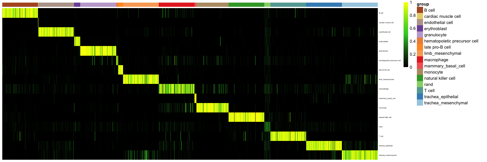

#### Attribute plot
```R
plot_attr(classRes_val_all, stTest, nrand=nrand, dLevel="newAnn", sid="cell")
```
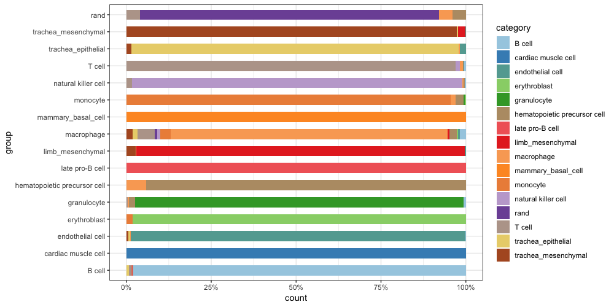

#### Apply to human query data
```R
system.time(expQueryTrans<-query_transform(expQuery[cgenesA,], xpairs))
   user  system elapsed 
  0.308   0.371   0.743
  
nqRand<-50
system.time(crHS<-rf_classPredict(rf_tspAll, expQueryTrans, numRand=nqRand))
   user  system elapsed 
  3.592   0.126   3.747 
```
#### Assess classifier with external dataset
```R
stQuery$description <- as.character(stQuery$description)
stQuery[which(stQuery$description == "NK cell"), "description"] = "natural killer cell"

tm_pbmc_assessment <- assess_comm(ct_scores = crHS, stTrain = stTrain, stQuery = stQuery, classTrain = "newAnn",classQuery="description",dLevelSID="sample_name")
plot_PRs(tm_pbmc_assessment)
```
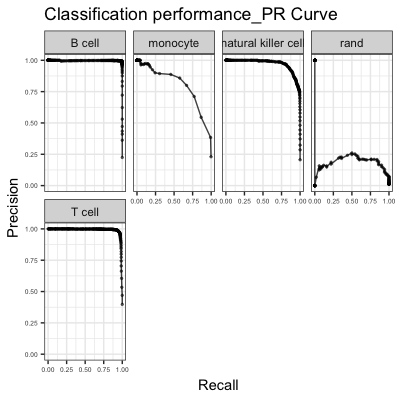

```R
plot_metrics(tm_pbmc_assessment)
```
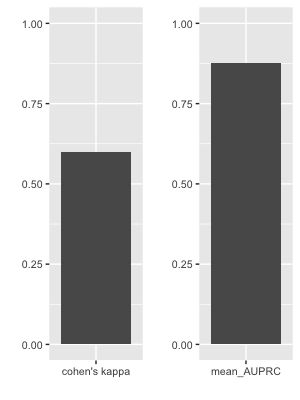

#### Classification result heatmap
```r
sgrp<-as.vector(stQuery$prefix)
names(sgrp)<-rownames(stQuery)
grpRand<-rep("rand", nqRand)
names(grpRand)<-paste("rand_", 1:nqRand, sep='')
sgrp<-append(sgrp, grpRand)

sc_hmClass(crHS, sgrp, max=5000, isBig=TRUE, cCol=F, font=8)
```
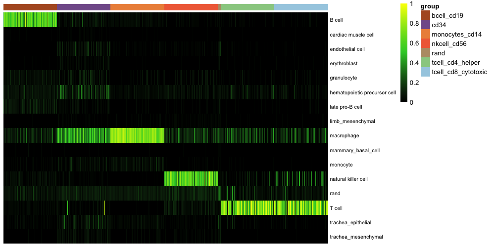

Note that the macrophage category seems to be promiscuous in the mouse held out data, too.

#### Classification violin plot
```R
sc_violinClass(sampTab = stQuery, classRes = crHS, cellIDCol = "sample_name", dLevel = "description")
```
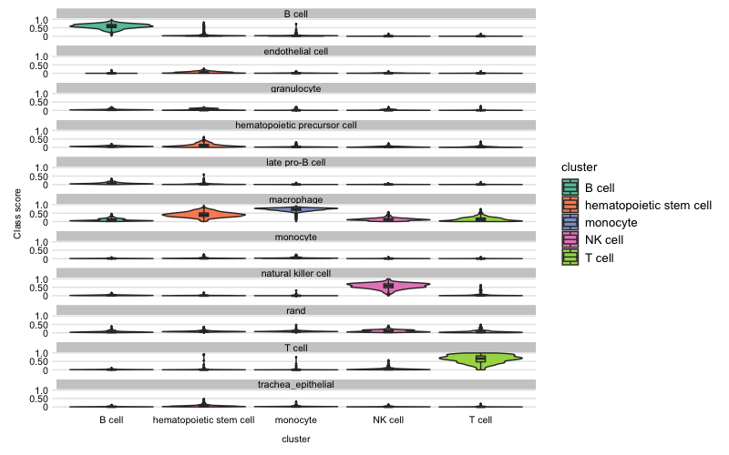

#### Classification violin plot with adjusted width

```R
sc_violinClass(sampTab = stQuery,classRes = crHS, cellIDCol = "sample_name", dLevel = "description", ncol = 11)
```
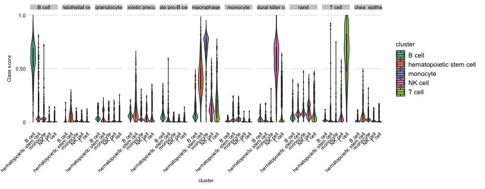

#### Classification violin plot with selected cluster

```R
sc_violinClass(stQuery, crHS, cellIDCol = "sample_name", dLevel = "description", ncol = 11, sub_cluster = "B cell")
```
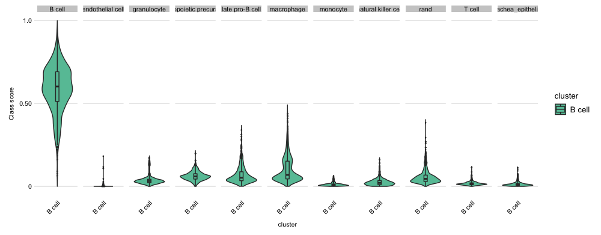

#### Attribution plot
```R
plot_attr(crHS, stQuery, nrand=nqRand, sid="sample_name", dLevel="description")
```
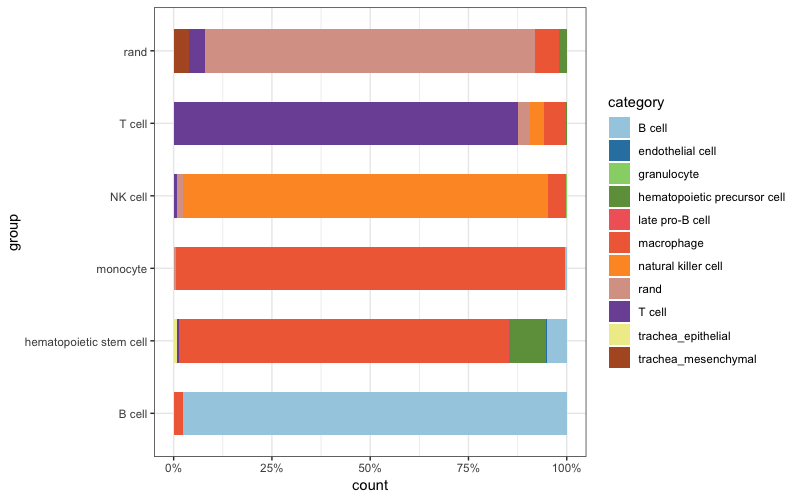

#### Attribution plot with subcluster focus
```R
plot_attr(sampTab = stQuery, classRes = crHS, sid = "sample_name", dLevel = "description", nrand = 50, sub_cluster = c("B cell", "T cell"))
```
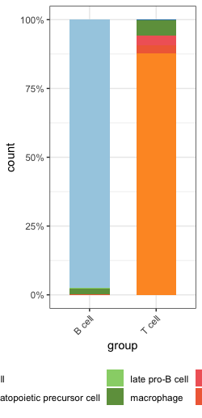

#### UMAP by category
```R
system.time(umPrep_HS<-prep_umap_class(crHS, stQuery, nrand=nqRand, dLevel="description", sid="sample_name", topPC=5))
  user  system elapsed
 26.905   1.014  27.993 
plot_umap(umPrep_HS)
```
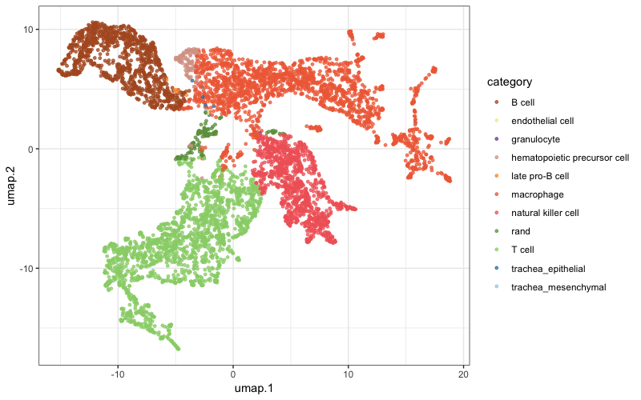

### Demonstrate how to integrate loom file to SCN
```
lfile <- loadLoomExpCluster("pbmc_6k.loom", cellNameCol = "obs_names", xname = "description")
stQuery = lfile$sampTab
dim(stQuery)
[1] 6000    2

expQuery = lfile$expDat
dim(expQuery)
[1] 32643  6000

With this you can rerun the cross-species analysis and follow the exact same steps
```

### More training data

|    study    |   species  | organ/tissue| seq method |    data    |
|-------------|------------|-------------|------------|------------|
|    Baron    |    human   |   pancreas  |   inDrop   |[data](https://s3.amazonaws.com/cnobjects/singleCellNet/resources/stList_Baron_human.rda)|
|    Baron    |    mouse   |   pancreas  |   inDrop   |[data](https://s3.amazonaws.com/cnobjects/singleCellNet/resources/stList_Baron_mouse.rda)|
|   Darmanis  |    human   | cortical neuron |   C1   | [data](https://s3.amazonaws.com/cnobjects/singleCellNet/resources/stList_Darminis.rda)|
|   TM10x     |    mouse   |    atlas    |     10x    | [data](https://s3.amazonaws.com/cnobjects/singleCellNet/resources/stList_tm10x.rda)|
|   TMfacs    |    mouse   |    atlas    |  Smart-Seq |[data](https://s3.amazonaws.com/cnobjects/singleCellNet/resources/stList_tmfacs.rda)|
