# singleCellNet

### Introduction
SingleCellNet enables the classifcation of single cell RNA-Seq data across species and platforms. See our recent [publication](https://doi.org/10.1016/j.cels.2019.06.004) for more details. Additionally, we have a [vignette](https://pcahan1.github.io/singleCellNet/) to guide you through the steps as well.  

Here, we illustrate ... 

- how to build and assess single cell classifiers 

- how to build and assess cross-species single cell classifiers

- how to use these classifiers to quantify 'cell identity' from query scRNA-Seq data

If you want to use the bulk RNA-Seq version of CellNet, go to [bulk CellNet](https://github.com/pcahan1/CellNet). 


### DATA

In this example, we use a subset of the Tabula Muris data to train singleCellNet. To learn more about the Tabula Muris project, see the [manuscript](https://www.biorxiv.org/content/early/2018/03/29/237446). As query data, we use scRNA-Seq of kidney cells as reported in [Park et al 2018](https://www.ncbi.nlm.nih.gov/pubmed/29622724). We also provide an example of classifying human, bead enriched PBMCs (from https://www.ncbi.nlm.nih.gov/pubmed/28091601). You can download this data here:

| APPLICATION | METADATA | EXPRESSION |
|-------------|----------|------------|
| Query       | [metadata](https://s3.amazonaws.com/cnobjects/singleCellNet/examples/sampTab_Park_MouseKidney_062118.rda) | [expression data](https://s3.amazonaws.com/cnobjects/singleCellNet/examples/expDat_Park_MouseKidney_062218.rda) |
| Training    | [metadata](https://s3.amazonaws.com/cnobjects/singleCellNet/examples/sampTab_TM_053018.rda) | [expression data](https://s3.amazonaws.com/cnobjects/singleCellNet/examples/expMatrix_TM_Raw_Oct_12_2018.rda) |
| cross-species | [human-mouse orthologs](https://s3.amazonaws.com/cnobjects/singleCellNet/examples/human_mouse_genes_Jul_24_2018.rda)|           |
| cross-species | [metadata](https://s3.amazonaws.com/cnobjects/singleCellNet/examples/stDat_beads_mar22.rda) | [expression data](https://s3.amazonaws.com/cnobjects/singleCellNet/examples/6k_beadpurfied_raw.rda) |

*more training datasets (metadata and expression data) are provided at the bottom of the page.

#### Setup
```R
install.packages("devtools")
devtools::install_github("pcahan1/singleCellNet")
library(singleCellNet)
```
#### Optional set up if you are working with loom files
```
devtools::install_github(repo = "hhoeflin/hdf5r")
devtools::install_github(repo = "mojaveazure/loomR", ref = "develop")
library(loomR)
```

#### Fetch the data if you have not already done so
```R
download.file("https://s3.amazonaws.com/cnobjects/singleCellNet/examples/sampTab_Park_MouseKidney_062118.rda", "sampTab_Park_MouseKidney_062118.rda")

download.file("https://s3.amazonaws.com/cnobjects/singleCellNet/examples/expMatrix_Park_MouseKidney_Oct_12_2018.rda", "expMatrix_Park_MouseKidney_Oct_12_2018.rda")

download.file("https://s3.amazonaws.com/cnobjects/singleCellNet/examples/expMatrix_TM_Raw_Oct_12_2018.rda", "expMatrix_TM_Raw_Oct_12_2018.rda")

download.file("https://s3.amazonaws.com/cnobjects/singleCellNet/examples/sampTab_TM_053018.rda", "sampTab_TM_053018.rda")

## For cross-species analyis:
download.file("https://s3.amazonaws.com/cnobjects/singleCellNet/examples/human_mouse_genes_Jul_24_2018.rda", "human_mouse_genes_Jul_24_2018.rda")

download.file("https://s3.amazonaws.com/cnobjects/singleCellNet/examples/6k_beadpurfied_raw.rda", "6k_beadpurfied_raw.rda")

download.file("https://s3.amazonaws.com/cnobjects/singleCellNet/examples/stDat_beads_mar22.rda", "stDat_beads_mar22.rda")

## To demonstrate how to integrate loom files to SCN
download.file("https://s3.amazonaws.com/cnobjects/singleCellNet/examples/pbmc_6k.loom", "pbmc_6k.loom")
```

#### Load query data
```R
stPark = utils_loadObject("sampTab_Park_MouseKidney_062118.rda")
expPark = utils_loadObject("expMatrix_Park_MouseKidney_Oct_12_2018.rda")
dim(expPark)
[1] 16272 43745

genesPark = rownames(expPark)

rm(expPark)
gc()
```

#### Load the training data
```R
expTMraw = utils_loadObject("expMatrix_TM_Raw_Oct_12_2018.rda")
dim(expTMraw)
[1] 23433 24936

stTM = utils_loadObject("sampTab_TM_053018.rda")
dim(stTM)
[1] 24936    17

stTM<-droplevels(stTM)
```

#### Find genes in common to the data sets and limit analysis to these
```R
commonGenes = intersect(rownames(expTMraw), genesPark)
length(commonGenes)
[1] 13831

expTMraw = expTMraw[commonGenes,]
```

#### Split for training and assessment, and transform training data
```R
stList = splitCommon(sampTab=stTM, ncells=100, dLevel="newAnn")
stTrain = stList[[1]]
expTrain = expTMraw[,rownames(stTrain)]
```

#### Train the classifier
```R
system.time(class_info<-scn_train(stTrain = stTrain, expTrain = expTrain, nTopGenes = 10, nRand = 70, nTrees = 1000, nTopGenePairs = 25, dLevel = "newAnn", colName_samp = "cell"))
   user  system elapsed 
 223.344  15.451 239.364
```

#### Apply to held out data
```R
#validate data
stTestList = splitCommon(sampTab=stList[[2]], ncells=100, dLevel="newAnn") #normalize validation data so that the assessment is as fair as possible
stTest = stTestList[[1]]
expTest = expTMraw[commonGenes,rownames(stTest)]

#predict
classRes_val_all = scn_predict(cnProc=class_info[['cnProc']], expDat=expTest, nrand = 50)
```

#### Assess classifier
```R
tm_heldoutassessment = assess_comm(ct_scores = classRes_val_all, stTrain = stTrain, stQuery = stTest, dLevelSID = "cell", classTrain = "newAnn", classQuery = "newAnn", nRand = 50)

plot_PRs(tm_heldoutassessment)
```
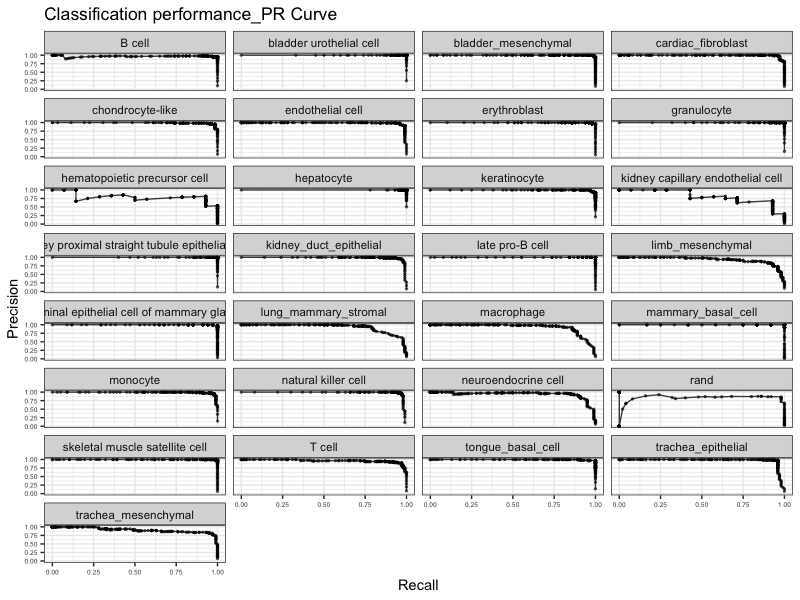

```R
plot_metrics(tm_heldoutassessment)
```
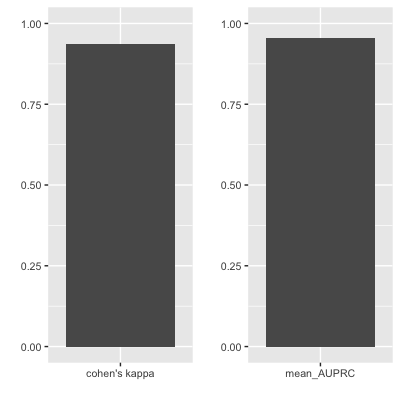

#### Classification result heatmap
```R

#Create a name vector label used later in classification heatmap where the values are cell types/ clusters and names are the sample names
 
nrand = 50
sla = as.vector(stTest$newAnn)
names(sla) = as.vector(stTest$cell)
slaRand = rep("rand", nrand) 
names(slaRand) = paste("rand_", 1:nrand, sep='')
sla = append(sla, slaRand) #include in the random cells profile created

sc_hmClass(classMat = classRes_val_all,grps = sla, max=300, isBig=TRUE)
```
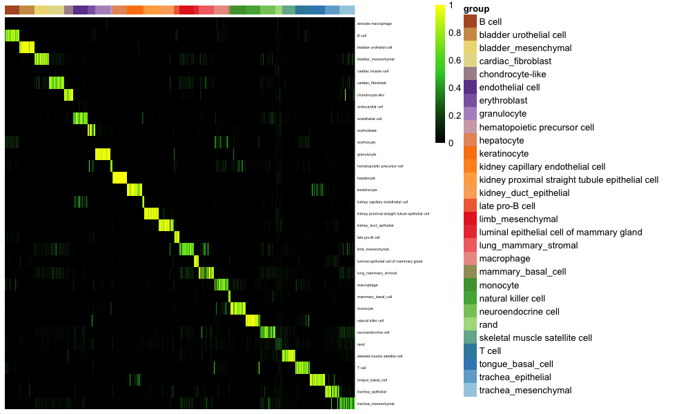

#### Attribution plot
```R
plot_attr(classRes=classRes_val_all, sampTab=stTest, nrand=nrand, dLevel="newAnn", sid="cell")
```
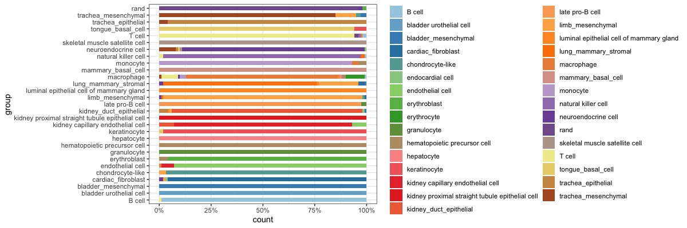

#### Viusalize average top pairs genes expression for training data
```R
gpTab = compareGenePairs(query_exp = expTest, training_exp = expTrain, training_st = stTrain, classCol = "newAnn", sampleCol = "cell", RF_classifier = class_info$cnProc$classifier, numPairs = 20, trainingOnly= TRUE)

train = findAvgLabel(gpTab = gpTab, stTrain = stTrain, dLevel = "newAnn")

hm_gpa_sel(gpTab, genes = class_info$cnProc$xpairs, grps = train, maxPerGrp = 50)
```
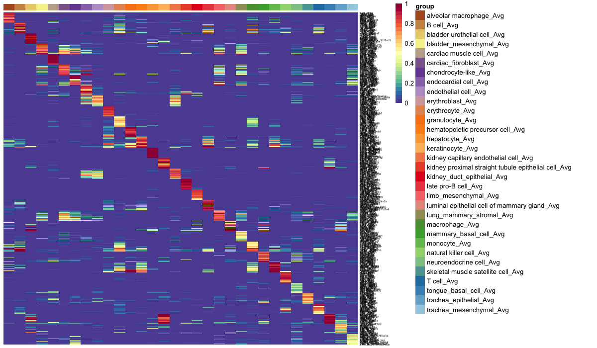

#### Apply to Park et al query data
```R
expPark = utils_loadObject("expMatrix_Park_MouseKidney_Oct_12_2018.rda") 
  
nqRand = 50
system.time(crParkall<-scn_predict(class_info[['cnProc']], expPark, nrand=nqRand))
   user  system elapsed 
 89.633   5.010  95.041 

sgrp = as.vector(stPark$description1)
names(sgrp) = as.vector(stPark$sample_name)
grpRand =rep("rand", nqRand)
names(grpRand) = paste("rand_", 1:nqRand, sep='')
sgrp = append(sgrp, grpRand)

# heatmap classification result
sc_hmClass(crParkall, sgrp, max=5000, isBig=TRUE, cCol=F, font=8)
```
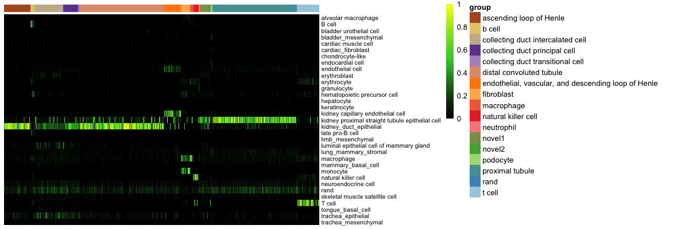

#### Classification annotation assignment
```R
# This classifies a cell with the category that has a classification score higher than 0.5 or the catgory with the highest classification score. 
# The annotation result can be found in a column named category in the query sample table.

stPark <- get_cate(classRes = crParkall, sampTab = stPark, dLevel = "description1", sid = "sample_name", nrand = nqRand)
```

#### Classification result violin plot
```R
sc_violinClass(sampTab = stPark, classRes = crParkall, sid = "sample_name", dLevel = "description1", addRand = nrand)
```
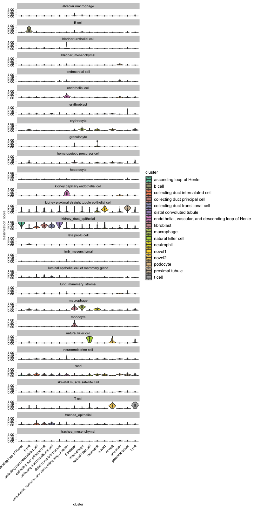

#### Skyline plot of classification results
```R
stKid2 = addRandToSampTab(crParkall, stPark, "description1", "sample_name")
skylineClass(crParkall, "T cell", stKid2, "description1",.25, "sample_name")
```
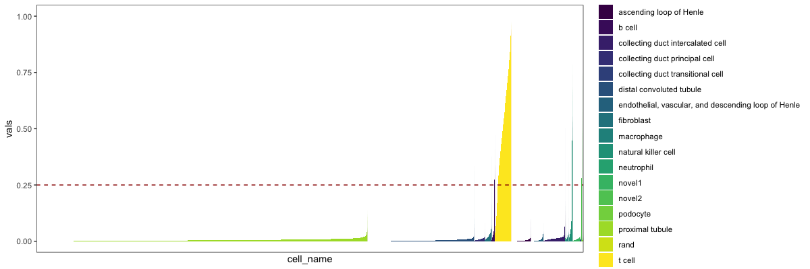

### Cross-species classification

#### Load the human query data
```R
stQuery = utils_loadObject("stDat_beads_mar22.rda")
expQuery = utils_loadObject("6k_beadpurfied_raw.rda") # use Matrix if RAM low
dim(expQuery)
[1] 32643  6000

stTM = utils_loadObject("sampTab_TM_053018.rda")
expTMraw = utils_loadObject("expMatrix_TM_Raw_Oct_12_2018.rda") # reload training
```

#### Load the ortholog table and convert human gene names to mouse ortholog names, and limit analysis to genes in common between the training and query data.
```R
oTab = utils_loadObject("human_mouse_genes_Jul_24_2018.rda")
dim(oTab)
[1] 16688     3

aa = csRenameOrth(expQuery, expTMraw, oTab)
expQueryOrth = aa[['expQuery']]
expTrainOrth = aa[['expTrain']]
```

#### Limit anlaysis to a subset of the TM cell types
```R
cts = c("B cell",  "cardiac muscle cell", "endothelial cell", "erythroblast", "granulocyte", "hematopoietic precursor cell", "late pro-B cell", "limb_mesenchymal", "macrophage", "mammary_basal_cell", "monocyte", "natural killer cell", "T cell", "trachea_epithelial", "trachea_mesenchymal")

stTM2 = filter(stTM, newAnn %in% cts)
stTM2 = droplevels(stTM2)
rownames(stTM2) = as.vector(stTM2$cell) # filter strips rownames

expTMraw2 = expTrainOrth[,rownames(stTM2)]
dim(expTMraw2)
[1] 14550 15161
```

#### Train Classifier
```R
stList = splitCommon(stTM2, ncells=100, dLevel="newAnn")
stTrain = stList[[1]]
expTrain = expTMraw2[,rownames(stTrain)]

system.time(class_info2<-scn_train(stTrain = stTrain, expTrain = expTrain, nTopGenes = 10, nRand = 70, nTrees = 1000, nTopGenePairs = 25, dLevel = "newAnn", colName_samp = "cell"))
   user  system elapsed 
 41.029   6.747  47.963 
```

#### Apply to held out data
```R
#validate data
stTestList = splitCommon(stList[[2]], ncells=100, dLevel="newAnn") 
stTest = stTestList[[1]]
expTest = expTMraw2[,rownames(stTest)]

#predict
system.time(classRes_val_all2 <- scn_predict(class_info2[['cnProc']], expTest, nrand = 50))
   user  system elapsed 
  0.691   0.032   0.724 
```

#### Assess classifier
```R
tm_heldoutassessment = assess_comm(ct_scores = classRes_val_all2, stTrain = stTrain, stQuery = stTest, dLevelSID = "cell", classTrain = "newAnn", classQuery = "newAnn", nRand = 50)

plot_PRs(tm_heldoutassessment)
```
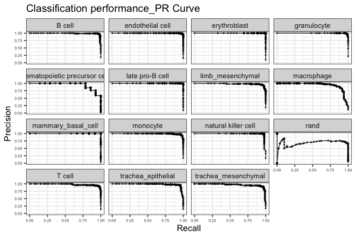

```R
plot_metrics(tm_heldoutassessment)
```


#### Classification result heatmap
```R
nrand=50
sla = as.vector(stTest$newAnn)
names(sla) = as.vector(stTest$cell)
slaRand = rep("rand", nrand)
names(slaRand) = paste("rand_", 1:nrand, sep='')
sla = append(sla, slaRand)

# heatmap classification result
sc_hmClass(classRes_val_all2, sla, max=300, font=7, isBig=TRUE)
```
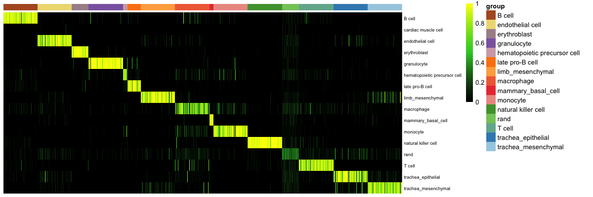

#### Attribute plot
```R
plot_attr(classRes_val_all2, stTest, nrand=nrand, dLevel="newAnn", sid="cell")
```
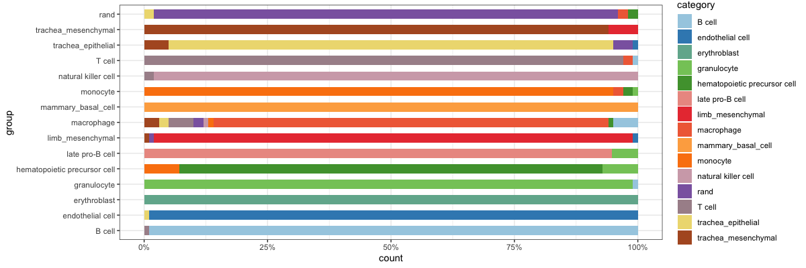

#### Apply to human query data
```R
stQuery$description = as.character(stQuery$description)
stQuery[which(stQuery$description == "NK cell"), "description"] = "natural killer cell"

nqRand = 50
system.time(crHS <- scn_predict(class_info2[['cnProc']], expQueryOrth, nrand=nqRand))
   user  system elapsed 
  3.566   0.548   4.166 
```

#### Assess classifier with external dataset
```R
tm_pbmc_assessment = assess_comm(ct_scores = crHS, stTrain = stTrain, stQuery = stQuery, classTrain = "newAnn",classQuery="description",dLevelSID="sample_name")
plot_PRs(tm_pbmc_assessment)
```
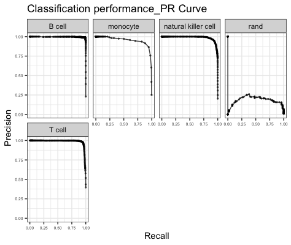

```R
plot_metrics(tm_pbmc_assessment)
```
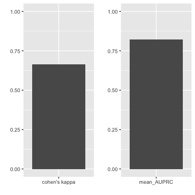

#### Classification result heatmap
```R
sgrp = as.vector(stQuery$prefix)
names(sgrp) = as.vector(stQuery$sample_name)
grpRand = rep("rand", nqRand)
names(grpRand) = paste("rand_", 1:nqRand, sep='')
sgrp = append(sgrp, grpRand)

sc_hmClass(crHS, sgrp, max=5000, isBig=TRUE, cCol=F, font=8)
```
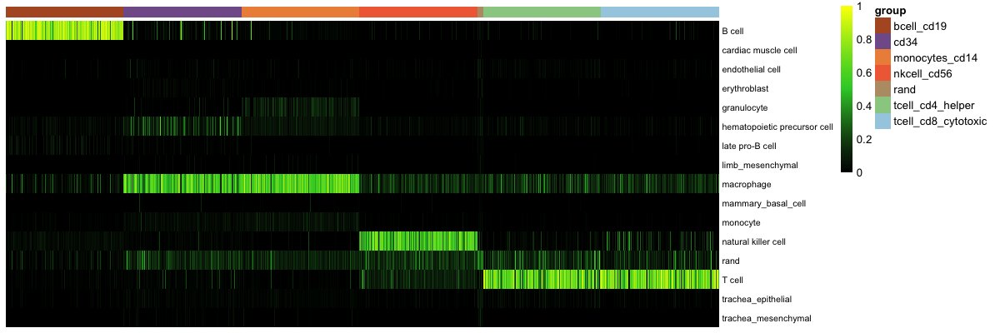

Note that the macrophage category seems to be promiscuous in the mouse held out data, too.

#### Classification violin plot
```R
sc_violinClass(sampTab = stQuery, classRes = crHS, sid = "sample_name", dLevel = "description")
```
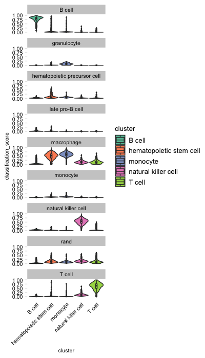

#### Classification violin plot with adjusted width

```R
sc_violinClass(sampTab = stQuery,classRes = crHS, sid = "sample_name", dLevel = "description", ncol = 12)
```
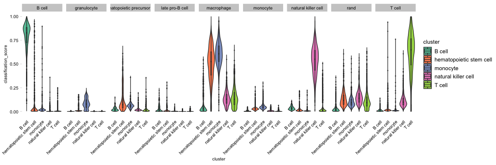

#### Classification violin plot with selected cluster

```R
sc_violinClass(stQuery, crHS, sid = "sample_name", dLevel = "description", ncol = 12, sub_cluster = "B cell")
```
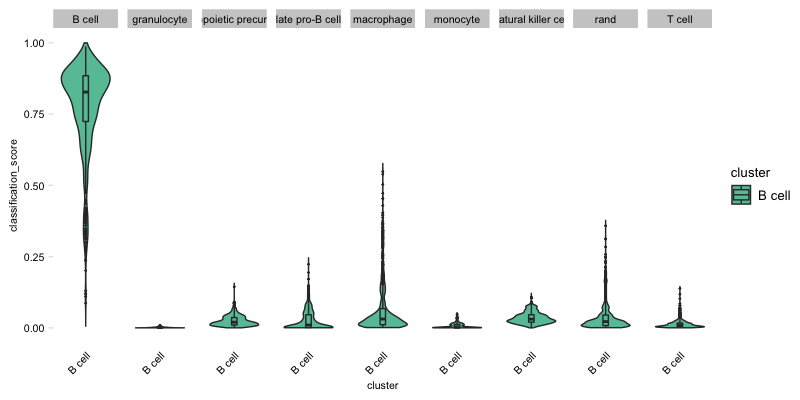

#### Attribution plot
```R
plot_attr(crHS, stQuery, nrand=nqRand, sid="sample_name", dLevel="description")
```
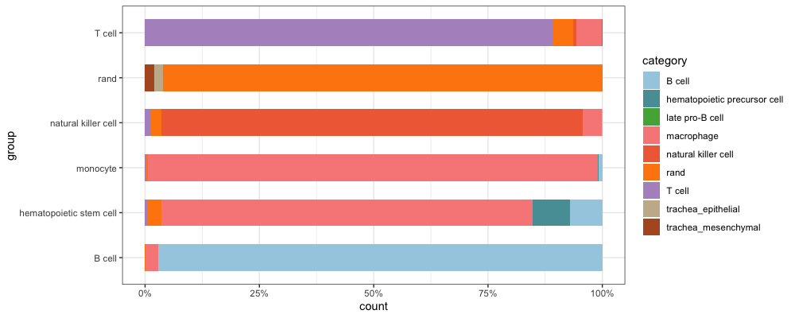

#### Attribution plot with subcluster focus
```R
plot_attr(sampTab = stQuery, classRes = crHS, sid = "sample_name", dLevel = "description", nrand = 50, sub_cluster = c("B cell", "T cell"))
```
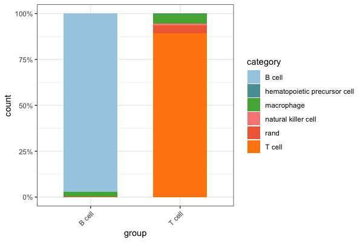

#### Heatmap top pairs genes for training sample average
```R
system.time(gpTab2 <- compareGenePairs(query_exp = expQueryOrth, training_exp = expTrainOrth, training_st = stTrain, classCol = "newAnn", sampleCol = "cell", RF_classifier = class_info2$cnProc$classifier, numPairs = 20, trainingOnly = FALSE))
   user  system elapsed 
 84.130   0.677  84.826

sgrp = as.vector(stQuery$prefix)
names(sgrp) = rownames(stQuery)
train2 = findAvgLabel(gpTab2, stTrain = stTrain, dLevel = "newAnn")
sgrp = append(sgrp, train2)

hm_gpa_sel(gpTab2, genes = class_info2$cnProc$xpairs, grps = sgrp, maxPerGrp = 5)
```
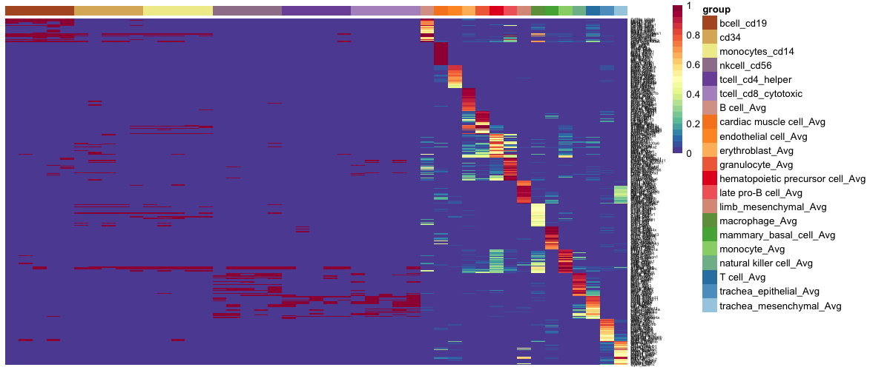

#### UMAP by category
```R
system.time(umPrep_HS<-prep_umap_class(crHS, stQuery, nrand=nqRand, dLevel="description", sid="sample_name", topPC=5))
  user  system elapsed 
 25.703   0.740  26.450 
plot_umap(umPrep_HS)
```
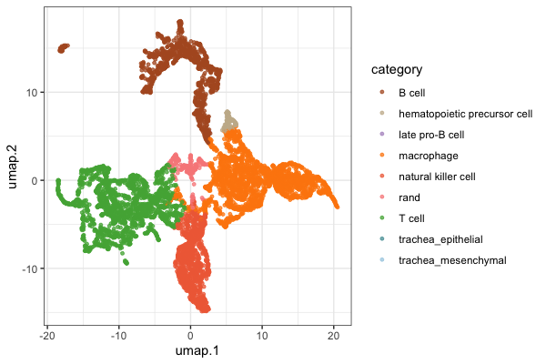

### How to integrate loom file to SCN
```R
lfile = loadLoomExpCluster("pbmc_6k.loom", cellNameCol = "obs_names", xname = "description")
stQuery = lfile$sampTab
dim(stQuery)
[1] 6000    2

expQuery = lfile$expDat
dim(expQuery)
[1] 32643  6000

#With this you can rerun the cross-species analysis and follow the exact same steps
```

### Integrate Seurat object to SCN analysis
```R
#exp_type options can be: counts, data, and scale.data if they are available in your sce object
scefile = extractSCE(sce_object, exp_slot_name = "counts") 
sampTab = scefile$sampTab
expDat = scefile$expDat
```

### Integrate SCE object to SCN analysis
```R
#exp_type options can be: counts, normcounts, and logcounts, if they are available in your sce object
seuratfile = extractSeurat(seurat_object, exp_slot_name = "counts")
sampTab = seuratfile$sampTab
expDat = seuratfile$expDat
```

### More training data for your own analysis

|    study    |   species  | organ/tissue| seq method |    data    |
|-------------|------------|-------------|------------|------------|
|    Baron    |    mouse   |   pancreas  |   inDrop   |[data](https://s3.amazonaws.com/cnobjects/singleCellNet/resources/stList_Baron_mouse.rda)|
|    Baron    |    human   |   pancreas  |   inDrop   |[data](https://s3.amazonaws.com/cnobjects/singleCellNet/resources/stList_Baron_human.rda)|
|   Murano*   |    human   |   pancreas  |  Cel-Seq2  | [data](https://s3.amazonaws.com/cnobjects/singleCellNet/resources/stList_murano.rda)|
|  Segerstolp |    human   |   pancreas  | Smart-Seq  | [data](https://s3.amazonaws.com/cnobjects/singleCellNet/resources/stList_Segerstolpe.rda)|
|    Park     |    human   |    kidney   |     10x    | [data](https://s3.amazonaws.com/cnobjects/singleCellNet/resources/stList_Park.rda)|
|    Haber    |    mouse   |   intestine | Smart-Seq2 | [data](https://s3.amazonaws.com/cnobjects/singleCellNet/resources/stList_Haber.rda)|
|    TM10x    |    mouse   |   subset    |     10x    | [data](https://s3.amazonaws.com/cnobjects/singleCellNet/resources/stList_tm10x.rda)|
|    TM10x    |    mouse   |    atlas    |     10x    | [data](https://s3.amazonaws.com/cnobjects/singleCellNet/resources/stList_tm10x_full.rda)|
|    TMfacs   |    mouse   |   subset    |  Smart-Seq |[data](https://s3.amazonaws.com/cnobjects/singleCellNet/resources/stList_tmfacs.rda)|
|    TMfacs   |    mouse   |    atlas    |  Smart-Seq |[data](https://s3.amazonaws.com/cnobjects/singleCellNet/resources/stList_tmfacs_full.rda)|
|    MWS      |    mouse   |    atlas    |microwell-seq|[data](https://s3.amazonaws.com/cnobjects/singleCellNet/resources/stList_MWS.rda)|
|    Zeisel   |    mouse   | barin altas |     10x    | [data](https://s3.amazonaws.com/cnobjects/singleCellNet/resources/stList_Zeisel.rda)|
|    Loo      |    mouse   |cortex(e14.5)|   Dropseq  | [data](https://s3.amazonaws.com/cnobjects/singleCellNet/resources/stList_Loo.rda)|
|    Darmanis |    human   |    cortex   |     C1     | [data](https://s3.amazonaws.com/cnobjects/singleCellNet/resources/stList_Darminis.rda)|
|    Gokce*   |    human   |   striatum  |C1 and Smart-Seq2| [data](https://s3.amazonaws.com/cnobjects/singleCellNet/resources/stList_Gocke.rda)|

*the expresion data is log-transformed.
