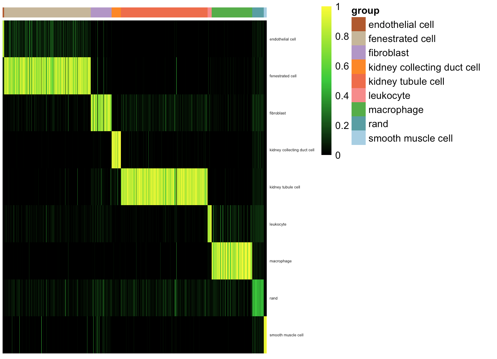
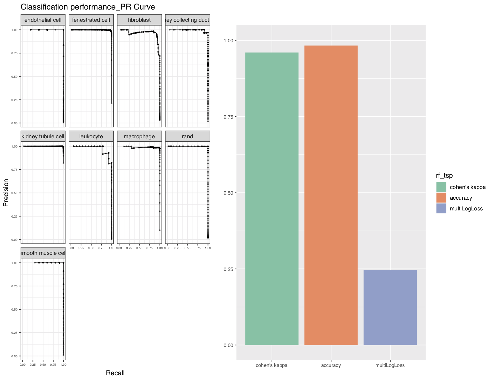

## Assessment and BenchMark Implementation

### Loading the packages
```{r,message=FALSE, warning=FALSE}
library(cluster)
library(pcaMethods)
library(rpca)
library(data.tree)
library(Rtsne)
library(ggplot2)
library(pheatmap)
library(RColorBrewer)
library(mclust)
library(randomForest)
library(singleCellNet)
library(reshape2)
library(patchwork)
library(MLmetrics)
library(cellrangerRkit)
library(dbscan)
library(tidyr)
library(CellNet)
library(pROC)
library(viridis)
library(fgsea)

mydate<-utils_myDate()
```


|         **Item**       |    **Status**   |
|------------------------|-----------------|
| Multiclass assessment  | code :thumbsup: |
| Cluster comparison     | code :thumbsup: |
| CrossSpecies & platform|    :octocat:    |


## Multiclass Assessment Demo 
### dataset use subset tm
```{r}
expDat <- utils_loadObject("~/Dropbox (CahanLab)/Yuqi.Tan.2/singleCellNet/ Gold Standard Datasets/app1_expDat_tm_10x_cgenes_Jun1_10x.rda")
stDat <- utils_loadObject("~/Dropbox (CahanLab)/Yuqi.Tan.2/singleCellNet/ Gold Standard Datasets/app1_stDat_tm_10x_cgenes_Jun1.rda")

#subset data
stDat_sub <- stDat[which(stDat$tissue %in% c("Kidney")),]
expDat_sub <- expDat[,which(colnames(expDat) %in% row.names(stDat_sub))]
```

## test tsp_rf classifiers
```{r}
#normalize data 
expTMnorm<-trans_prop(weighted_down(expDat_sub, 1.5e3), 1e4)

#no splitCommon
source("~/Desktop/singleCellNet_rf_tsp_sourceFunction.R")
stList<-splitCommon(stDat_sub, ncells=40, dLevel="cell_ontology_class") #equal number of cells to train 
stTrain<-stList[[1]]
expTrain<-expTMnorm[,rownames(stTrain)]
```

```{r, warning=FALSE}
#finding top pairs
system.time(cgenes2<-findClassyGenes(expTrain, stTrain, "cell_ontology_class", topX=10))

cgenesA<-cgenes2[['cgenes']]
grps<-cgenes2[['grps']]
length(cgenesA)

hm_gpa_sel(expTrain, cgenesA, grps, maxPerGrp=5, toScale=T, cRow=F, cCol=F,font=4)
```


```{r, warning=FALSE}
#subset data
system.time(pairDat<-pair_transform(expTrain[cgenesA,]))

system.time(xpairs<-gnrBP(pairDat, grps))
length(xpairs)

#train classifiers
system.time(rf_tspAll<-sc_makeClassifier(pairDat[xpairs,], genes=xpairs, groups=grps, nRand=40, ntrees=1000)) 

#apply heldout data
stTest<-stList[[2]]
system.time(expQtransAll<-query_transform(expDat_sub[cgenesA,rownames(stTest)], xpairs))
system.time(classRes_val_all<-rf_classPredict(rf_tspAll, expQtransAll, numRand=40))

#make new sample table with random cells added to the mix
sla<-as.vector(stTest$cell_ontology_class)
names(sla)<-rownames(stTest)
slaRand<-rep("rand", 40)
names(slaRand)<-paste("rand_", 1:40, sep='')
sla<-append(sla, slaRand)

sc_hmClass(classRes_val_all, sla, max=300, isBig=TRUE)
```


```{r}
#multiclass assessment 
source("~/Desktop/gpa_assess/sc_assess_anno.R")
newSampTab<-makeSampleTable(classRes_val_all, stTest, 40, "sample_name")
tm_heldoutassessment <- assessmentReport(classRes_val_all, stTest, nRand=40)
#plot all the assessmentReport
plot_multiAssess(tm_heldoutassessment)
```



#multiclass assessment v2
source("~/Desktop/gpa_assess/assessed.R")
comm <- SubsetQueryBasedOnTraining(stQuery_kid, stTrain = stDat_tm, classTrain = "cell_ontology_class", classQuery = "description2",ct_scores = classRes_val_all,nRand = 50)
tm_heldoutassessment <- assessmentReport_comm(comm$ct_score_com, classLevels = "description2",comm$stVal_com)
plot_multiAssess(tm_heldoutassessment, method = "tsp_rf", ylimForMultiLogLoss = 500) 


