# singleCellNet

### Introduction
See [CellNet](https://github.com/pcahan1/CellNet) for an introduction to CellNet, how to use it on bulk RNA-Seq, and how to analyze scRNA-Seq data with classifiers trained on bulk RNA-Seq. Here, we illustrate how to cluster single cell RNA-Seq data, build single cell classifiers based on the clustering results, and use these classifiers to assign 'cell identity' to scNRA-Seq data.

Shortcut to [wash/chop/steam/butter pipeline](#wcsb)

#### New clustering pipeline

Sample data:

[Expression data](https://s3.amazonaws.com/cellnet-rnaseq/ref/examples/expWashed_Jun_07_2017.rda)
[Meta-data](https://s3.amazonaws.com/cellnet-rnaseq/ref/examples/stWashed_Jun_07_2017.rda)


#### Setup
```R
library(devtools)
install_github("pcahan1/singleCellNet", ref="master")
library(cluster)
library(pcaMethods)
library(rpca)
library(data.tree)
library(Rtsne)
library(ggplot2)
library(pheatmap)
library(dbscan)
library(RColorBrewer)
library(WGCNA)
library(mclust)
library(randomForest)
library(igraph)
## For PGA
library(cluster)
library(pcaMethods)
library(rpca)
library(data.tree)
```

#### Load data
```R
expDat<-utils_loadObject("expWashed_Jun_07_2017.rda")
stDat<-utils_loadObject("stWashed_Jun_07_2017.rda")
```

#### Run GPA pipeline to fund clusters
```R
system.time(xTree<-gpa_recurse(expDat, zThresh=2, maxLevel=3, nPCs=2, SilhDrop=0.1, methods=c("cutree", "kmeans")))
   user  system elapsed 
116.063  12.070 128.227
```

#### Print the clusters and their top genes
```R
pprint(xTree$groupTree, "cells", "silh", "topGenes")
      levelName cells      silh                                    topGenes
1 L1_G1          5496 0.0000000                                            
2  ¦--L2_G1      3626 0.6994262              LTB, RPL29, LDHB, EEF1B2, CD3D
3  ¦   ¦--L3_G1   972 0.7746405   CD79A, CD79B, HLA-DRB1, HLA-DRA, HLA-DRB5
4  ¦   ¦--L3_G2   812 0.8150246 AIF1, RP11-620J15.3, SPINK2, LST1, KIAA0125
5  ¦   °--L3_G3  1842 0.8182872               CD3D, CD3E, IL32, B2M, GIMAP7
6  ¦--L2_G2       921 0.7471813             S100A9, S100A8, LYZ, CST3, FCN1
7  °--L2_G3       949 0.8061697               GNLY, GZMB, NKG7, GZMA, CLIC3
```

#### Plot the cell-cell correlation matrix
```R
corplot_sub(xTree, expDat, min=20, prop=.10, pSide=TRUE)
```

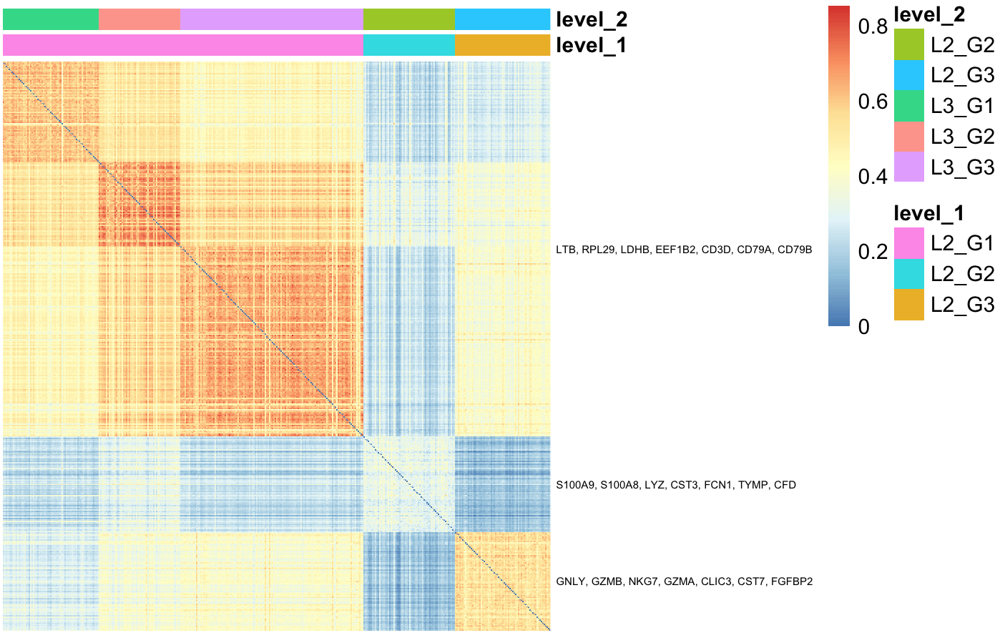

#### Plot the genes distinguishing the top-level clusters
```R
hm_gpa(expDat, xTree$results[["L1_G1"]], maxPerGrp=300, topx=15, toScale=T)
```


#### Plot the genes distinguishing the L2_G1 clusters
```R
hm_gpa(expDat, xTree2$results[["L2_G1"]], maxPerGrp=300, topx=15, toScale=T)
```

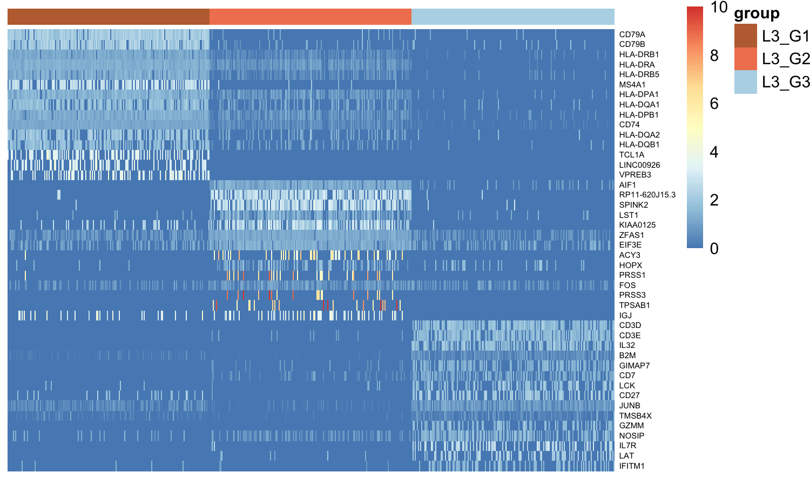

#### Plot Principle components of all cells
```R
plotGPALevel(xTree, "L1_G1", legend=T)
```

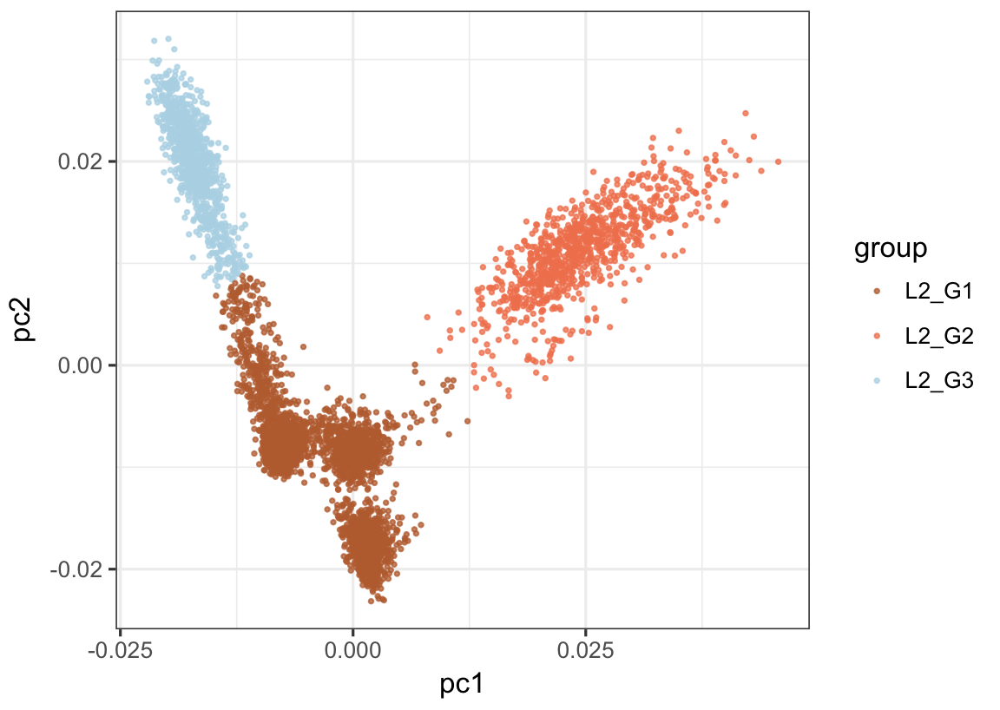

#### Plot Principle components of cells in L2_G1
```R
plotGPALevel(xTree, "L2_G1", legend=T)
```

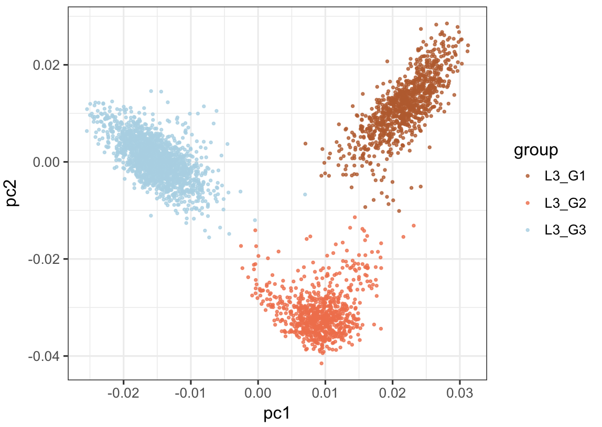


#### <a name="wcsb">wash/chop/steam/butter pipeline</a>

#### Processing pipeline

1. Load
2. Wash 
  * down sample
  * exclude undetected genes
  * apply selected transform
    * proportional (default)
    * rank
    * zscore
    * binarize
  * results in object that has
    * arg list
    * expMatrix
    * transMethod
3. Chop (dimension reduction)
  * methods
    * PCA
    * tSNE
  * results in a list of
    * choppedData
    * arg lis
    * varGenes
4. Steam (assign cells to groups)
  * methods
    * manual
    * mclust
    * dynamic tree cut
  * results in a list of
    * sample table
    * arg list
    * optimized parameters (mclust=G and model shape, dt=minModSize and deepSplit, dbscan=eps and minPts)
    * method name
5. Butter (make and assess classifiers)
6. Toss (classify new samples)
7. Mix (integrate new training data)


#### Setup

```R
    library(devtools)
    install_github("pcahan1/singleCellNet", ref="master")
    library(singleCellNet)
    library(cellrangerRkit)
    library(Rtsne)
    library(ggplot2)
    library(pheatmap)
    library(dbscan)
    library(RColorBrewer)
    library(WGCNA)
    library(mclust)
    library(randomForest)
```
    
#### Load data
```R
    rawDat<-mergeLoad10x("pathTo/10x_public/Zheng_2016/bead_purified/", c("bcell_cd19", "cd34", "monocytes_cd14", "nkcell_cd56", "tcell_cd4_helper", "tcell_cd8_cytotoxic"), nCells=1e3))
```
#### Basic transform: normalize to total counts, then Log(1+norm), after down sampling
```R
    expDat<-rawDat[['expDat']]
    stDat<-rawDat[['sampTab']]

```

#### Wash
```R
    pwashed<-prewash(expDat, stDat, countDepth = 1e3)
    washedProp<-wash(pwashed, transMethod="prop"))
```

#### Chop, Steam, and assess classifiers based only on expProp
```R
    cAssAll<-pipe_cAss(washedProp, stDat)
    ggplot(cAssAll, aes(x=group, y=classDiff)) + geom_boxplot(alpha=.75,colour="black", outlier.colour="#BDBDBD", outlier.size=.5) + xlab("cluster") + theme_bw() + facet_wrap( ~ method)
```
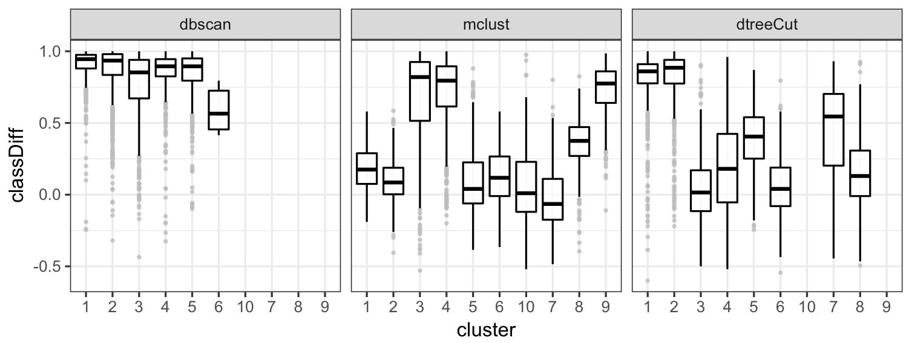

#### Chop and Steam, useful when assessing various wash methods
```R
    steamed<-pipe_steam_list(washedProp, stDat, topPC=20)
```

#### make classifiers and assess -- expProp
```R
    classAssProp<-pipe_cAss_all(steamed, washedProp, stDat)
    ggplot(classAssProp, aes(x=method, y=classDiff)) + geom_boxplot(alpha=.75,colour="black", outlier.colour="#BDBDBD", outlier.size=.5) + xlab("cluster") + theme_bw()
```
#### Binary data
```R
    washedBinary<-wash(pwashed, transMethod="binary"))
    cAssBinary<-pipe_cAss_all(steamed, washedBinary$expDat, stDat)
```

#### zscore data
```R
    washedZscore<-wash(pwashed, transMethod="zscore"))
    # make sure gene names are here
    rownames(washedZscore$expDat) <- rownames(washedBinary$expDat)
    cAssZscore<-pipe_cAss_all(steamed, washedZscore$expDat, stDat)
````

#### compare all methods
```R
    cAssBound<-cbind(classAssProp, wash=rep("prop", nrow(classAssProp)))
    cAssBound<-rbind(cAssBound, cbind(cAssBinary, wash=rep("binary", nrow(cAssBinary))))
    cAssBound<-rbind(cAssBound, cbind(cAssZscore, wash=rep("zscore", nrow(cAssZscore))))

    ggplot(cAssBound, aes(x=method, y=classDiff,fill=wash )) + geom_boxplot(alpha=.75,colour="black", outlier.colour="#BDBDBD", outlier.size=.5) + xlab("Steam method") + theme_bw()
```
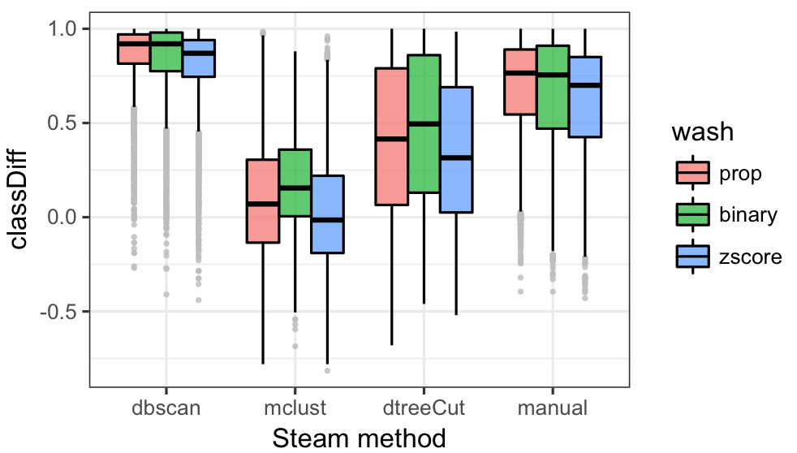

Added on 06-01-17

Instructions for loading package, making a dbscan/binary data classifier, and applying it to a new data set

```R
    library(devtools)
    devtools::install_github("pcahan1/singleCellNet")
    library(singleCellNet)
    library(cellrangerRkit)
    library(Rtsne)
    library(ggplot2)
    library(pheatmap)
    library(dbscan)
    library(RColorBrewer)
    library(WGCNA)
    library(mclust)
    library(randomForest)
```

Load training data -- takes 2-3 minutes
```R
    system.time(rawDat<-mergeLoad10x("yourPathTo/10x_public/Zheng_2016/bead_purified/", c("bcell_cd19", "cd34", "monocytes_cd14", "nkcell_cd56", "tcell_cd4_helper", "tcell_cd8_cytotoxic"), nCells=1e3))

    expDat<-rawDat[['expDat']]
    stDat<-rawDat[['sampTab']]
```

wash, steam, butter
```R
    system.time(pWashed<-prewash(expDat, stDat, countDepth=1e3))
    system.time(washedProp<-wash(pWashed, transMethod="prop"))
    system.time(db_steamed<-pipe_dbscan(washedProp, stDat, topPC=6, zThresh=2))
    system.time(washedBinary<-wash(pWashed, transMethod="binary"))
    system.time(binClassifiers<-pipe_butter(db_steamed, washedBinary))
    hmClass(binClassifiers[['classResVal']][['classRes']], isBig=T)
```
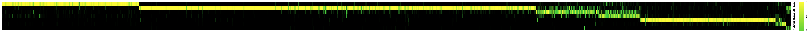

Load query data and classify
```R
    ppath<-paste0("yourPathTo/10x_public/Zheng_2016/frozen_a/filtered_matrices_mex/hg19")
    tmpX<-load10x(ppath, "frozen_a")

    expRaw_FA<-tmpX[['expDat']]
    stFA<-tmpX[['sampTab']]
    system.time(pWashed_FA<-prewash(expRaw_FA, stFA, countDepth=1e3))
    system.time(washedBinary_FA<-wash(pWashed_FA, transMethod="binary",removeBad=FALSE))
    fa_class<-butter_classify(washedBinary_FA,binClassifiers)
    hmClass(fa_class, isBig=T, cluster_cols=TRUE) 
```

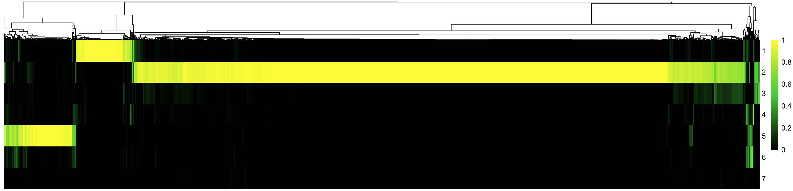


#### some plotting functions

```R
    dotplot_pipesteamed(db_steamed)
```

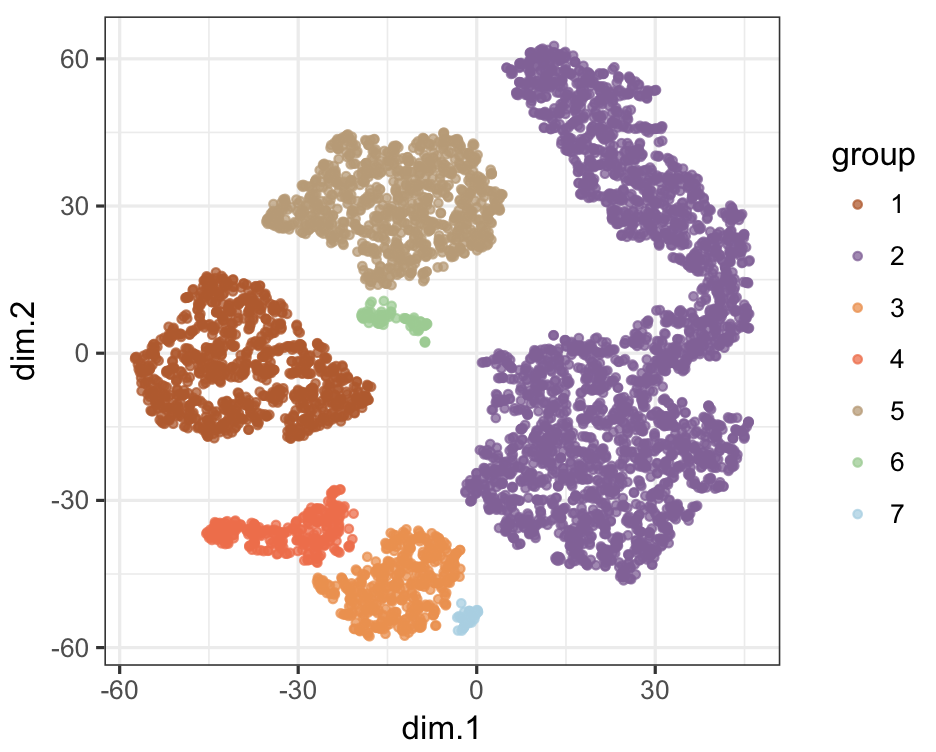

```R
   washedProp_query<-wash(pWashed_FA, transMethod="prop")
    db_steamed_query<-pipe_dbscan(washedProp_query, stFA, nClusters=c(3,10),topPC=12, zThresh=1.5)
    dotplot_pipesteamed(db_steamed_query)
```

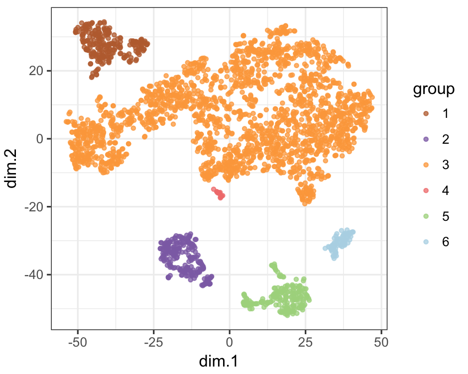

Overlay classification results
```R
    library(tidyr)
    tsneClass(fa_class, db_steamed_query)
```

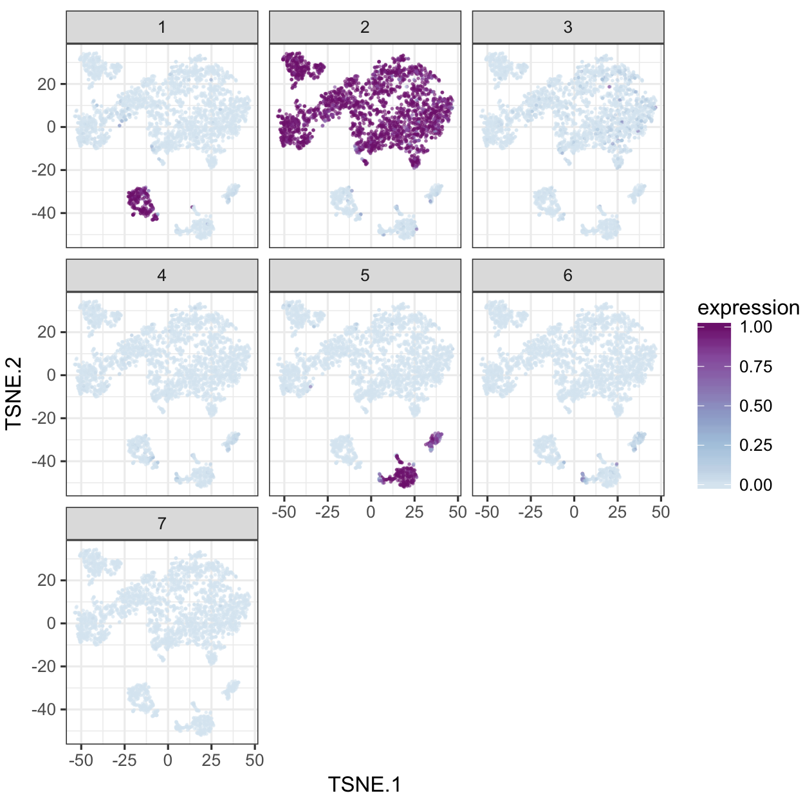


Gene Ontology annotation. Find cell surface genes
```R
library("org.Mm.eg.db")
library(GO.db)
annDat<-annSetUp()
ccGenes<-unique(getGenesFromGO("GO:0009986", annDat))
length(ccGenes)
[1] 829

allGenes<-rownames(washedProp$expDat)
mGenes<-intersect(allGenes, ccGenes)
```

Differential expression
```R
diffExp<-par_findSpecGenes(washedProp$expDat[mGenes,], db_steamed$steamed$sampTab, minSet=FALSE)
### find the top 30 genes in each cluster
ct1<-lapply( diffExp, getTopGenes, 30)


### Heatmap these genes
hm_genes(washedProp, db_steamed, unique(unlist(ct1)), cRow=T, font=3, limits=c(0,10), toS=F)
```


