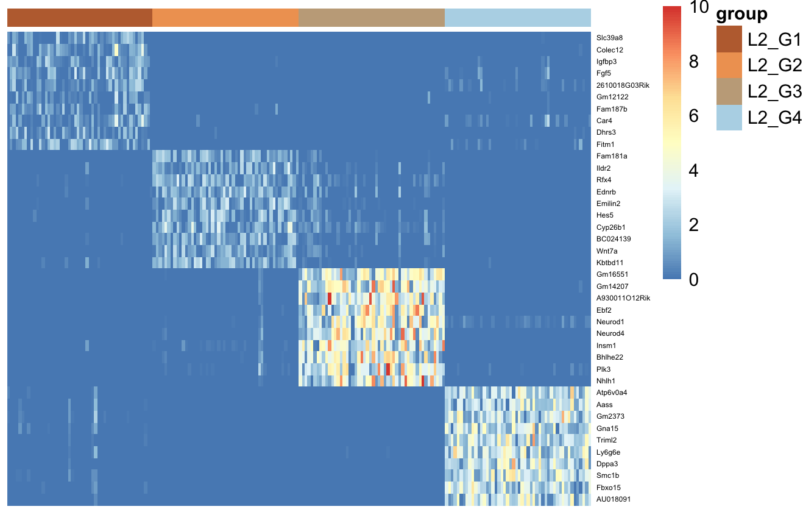
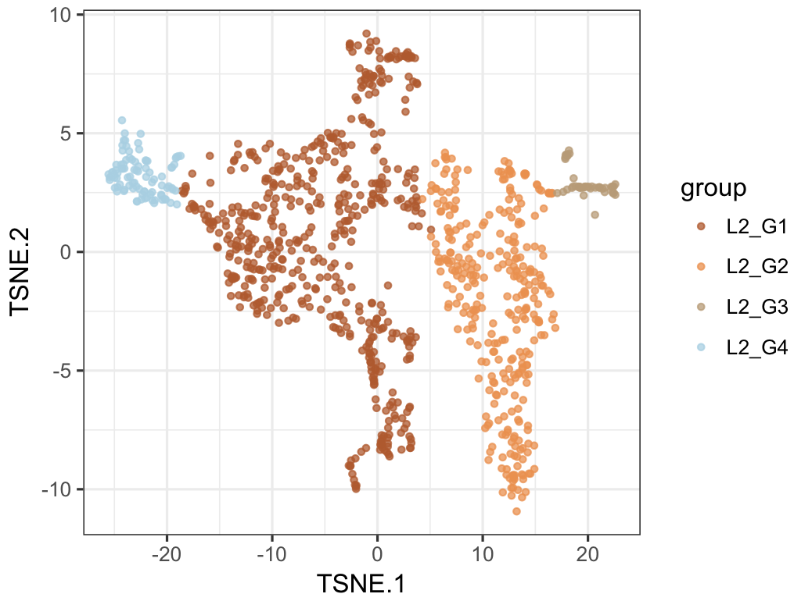
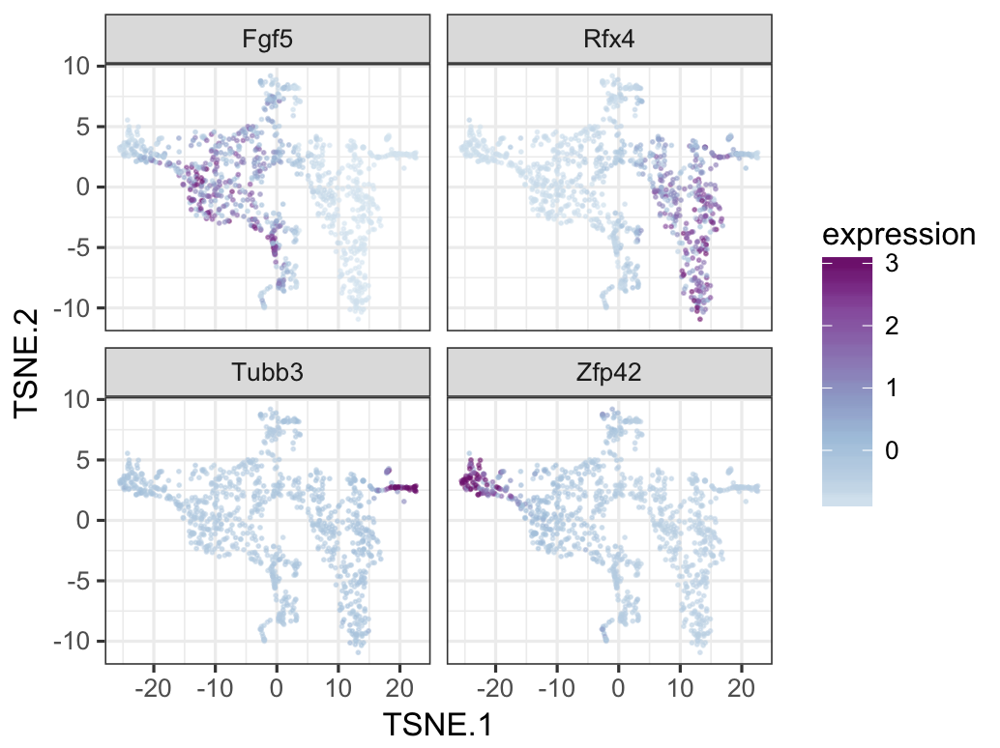
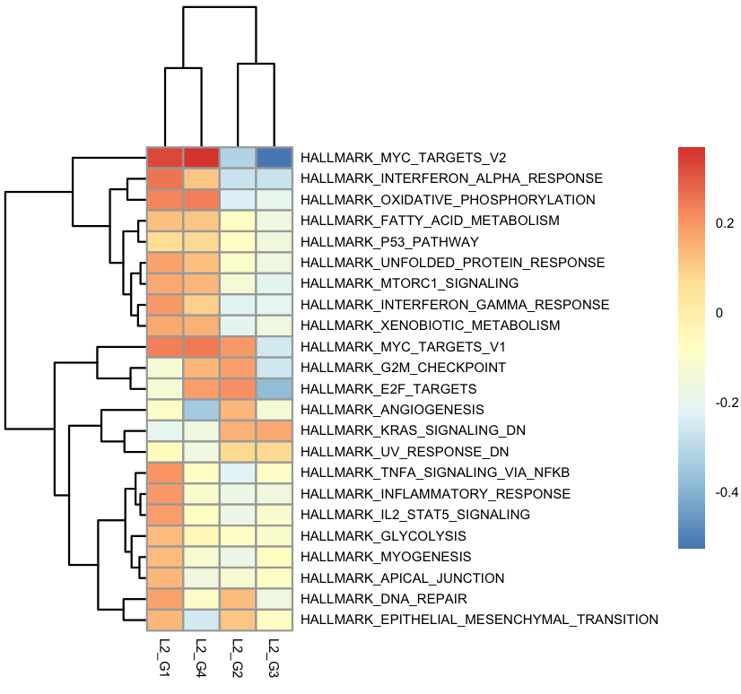
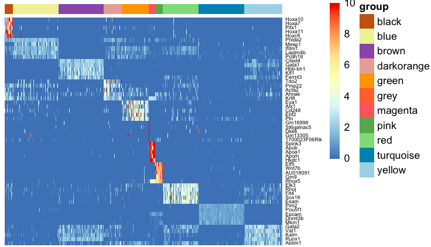
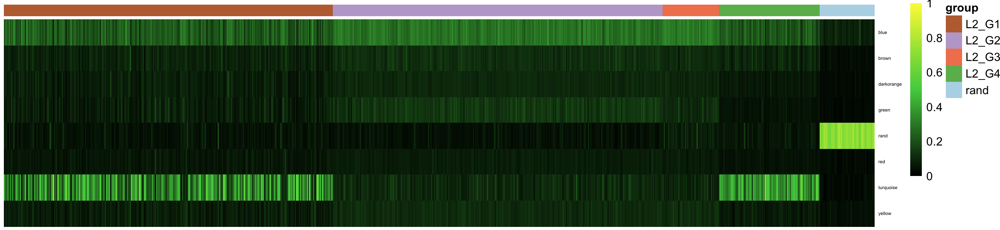
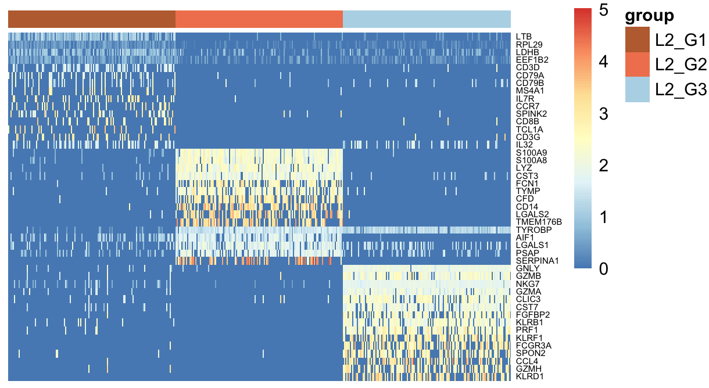

# singleCellNet

### Introduction
See [CellNet](https://github.com/pcahan1/CellNet) for an introduction to CellNet, how to use it on bulk RNA-Seq, and how to analyze single cell RNA-Seq (scRNA-Seq) data with classifiers trained on bulk RNA-Seq. Here, we illustrate

- how to build and assess single cell classifiers

- how to use these classifiers to quantify 'cell identity' from query scRNA-Seq data

- how to cluster scRNA-Seq data using our 'cluster by competition' method

### DATA

In this example, we use a subset of the Tabula Muris data to train singleCellNet. To learn more about the Tabula Muris project, see the [manuscript])(https://www.biorxiv.org/content/early/2018/03/29/237446). As query data, we use scRNA-Seq of kidney cells as reported in [Park et al 2018](https://www.ncbi.nlm.nih.gov/pubmed/29622724). You can download this data here:

| APPLICATION | METADATA | EXPRESSION |
|-------------------------------------|
| Query       | [metadata](https://s3.amazonaws.com/cnobjects/singleCellNet/examples/sampTab_Park_MouseKidney_062118.rda) | [expression data*](https://s3.amazonaws.com/cnobjects/singleCellNet/examples/GSE107585_Mouse_kidney_single_cell_datamatrix.txt.gz) |
| Training    | [metadata](https://s3.amazonaws.com/cnobjects/singleCellNet/examples/sampTab_TM_053018.rda) | [expression data](https://s3.amazonaws.com/cnobjects/singleCellNet/examples/expTM_Raw_053018.rda) |

*N.B. The query expression data needs to be decompressed before loading it into R. 


#### Setup
```R
library(cluster)
library(pcaMethods)
library(rpca)
library(data.tree)

library(Rtsne)
library(ggplot2)
library(pheatmap)

library(RColorBrewer)

library(mclust)
library(randomForest)
library(singleCellNet)

if(FALSE){
    source("~/Dropbox/Code/singleCellNet/R/utils.R")
    source("~/Dropbox/Code/singleCellNet/R/plots.R")
    source("~/Dropbox/Code/singleCellNet/R/wash.R")
    source("~/Dropbox/Code/singleCellNet/R/chop.R")
    source("~/Dropbox/Code/singleCellNet/R/steam.R")
    source("~/Dropbox/Code/singleCellNet/R/butter.R")
    source("~/Dropbox/Code/singleCellNet/R/10x.R")
    source("~/Dropbox/Code/singleCellNet/R/stats.R")
    source("~/Dropbox/Code/singleCellNet/R/pipes.R")
    source("~/Dropbox/Code/singleCellNet/R/gpa.R")
    source("~/Dropbox/Code/singleCellNet/R/classify.R")
    source("~/Dropbox/Code/singleCellNet/R/annotation.R")
}

mydate<-utils_myDate()
```

Load query data
```R
expDat<-utils_loadObject("expDat_x4_Dec_09_2017.rda")
sampTab<-utils_loadObject("sampTab_x4_Dec_09_2017.rda")
```

Cluster. This takes about 20-30 seconds.
```R
system.time(xTree<-gpa_recurse(expDat, zThresh=2, maxLevel=3, nPCs=2, SilhDrop=0.5, methods=c("kmeans", "cutree"), dThresh=0.5, pcaMethod="prcomp",k=2:15, minClusterSize=100))

# this is needed for later plotting
sampTab<-cbind(sampTab, cluster=xTree$groups)
```

Print a tree of the clusters
```R
print(xTree$groupTree, "cells", "silh", "topGenes")
  levelName cells        silh                                       topGenes
1 L1_G1      1000  0.00000000                                               
2  ¦--L2_G1   536  0.36359001                Slc39a8, Fgf5, Car4, Fgf8, Eras
3  ¦--L2_G2   321  0.70227056              Fam181a, Ildr2, Rfx4, Ednrb, Hes5
4  ¦--L2_G3    51 -0.03229656 Gm16551, Gm14207, A930011O12Rik, Ebf2, Neurod1
5  °--L2_G4    92  0.58562889          Atp6v0a4, Aass, Gm2373, Gna15, Triml2
```

Show the top genes in each cluster
```R
xdiff<-gnrAll(expDat, xTree$groups)
x1<-lapply( xdiff, getTopGenes, 10)
x1<-x1[order(names(x1))]

 hm_gpa_sel(expDat, c(unique(unlist(x1))), xTree$groups, maxPerGrp=50, toScale=T, cRow=F, font=4)
```



Plot top 2 PCs
```R
plotGPALevel(xTree, "L1_G1", legend=T)
```


t-SNE. See https://distill.pub/2016/misread-tsne/ for selecting perplexity and intepretation of t-sne
```R
ts1<-pca_to_tsne(xTree, perplexity=50, theta=0.75)
plot_tsne(sampTab, ts1, cname="cluster")
```


More t-SNE
```R
tsneMultsimp(ts1, expDat, c("Fgf5", "Zfp42", "Tubb3", "Rfx4"))
```



Gene set enrichment
```R
gsHallmarks<-utils_loadObject("mouse_symbols_H_v5p2_Dec_11_2017.rda")
system.time(xresCC<-ks.wrapper.set(xdiff, gsHallmarks))

# extract matrix of enrichment scores
esMat_cc<-ks.extract(xresCC, sigThresh=1e-2)
x<-esMat_cc[,sort(colnames(esMat_cc))]
pheatmap(x, fontsize=5, cluster_cols=T)
```



Other gene sets for enrichment are listed above.


Now, compare this data set to embryo-derived data.

Load the emryo data
```R
expScia<-utils_loadObject("embryo_Scialdone_Gottgens_2016/Scialdone_Gottgens_expComplete_Dec_03_2017.rda")
stScia<-utils_loadObject("embryo_Scialdone_Gottgens_2016/Scialdone_Gottgens_stComplete_Dec_03_2017.rda")
```

We have to use the raw query data, so load that.
```R
expRaw<-utils_loadObject("expQuery_Counts_Dec_12_2017.rda")
```

Harmonize the data sets. This takes about 5-7 minutes.
```R
dsVal<-1e4
system.time(hlistScia<-harmonize( list(query=expRaw, scia=expScia), trans=c(TRUE, TRUE), dsVal=dsVal))
   user  system elapsed 
349.578  16.416 366.160
```

Find genes as predictors for embryo cell type classifier. The cluaster assignment for these cells has been provided for us.
```R
cellgrps<-stScia$cluster
names(cellgrps)<-rownames(stScia)
xdiff_scia<-gnrAll(hlistScia[['transList']][['scia']], cellgrps)

# plot the top 5 per group. Note that the color labels come from the provided cluster labels and don't correspond to the column color bar
xScia<-lapply( xdiff_scia, getTopGenes, 5)
xScia<-xScia[order(names(xScia))]
hm_gpa_sel(hlistScia[['transList']][['scia']], c(unique(unlist(xScia))), cellgrps, maxPerGrp=100, toScale=T, cRow=F, font=5, limits=c(0,10))
```



Limit making classifier for groups with at least 20 cells.
```R
goodGrps<-names(which(table(stScia$cluster)>=20))
stTmp<-data.frame()
for(ggood in goodGrps){
  stTmp<-rbind(stTmp, stScia[stScia$cluster==ggood,])
}

dim(stTmp)
[1] 1156    7

cellgrps<-stTmp$cluster
names(cellgrps)<-rownames(stTmp)
```

Make the classifiers
```R
system.time(rf_scia<-sc_makeClassifier(hlistScia[['probList']][['scia']][,names(cellgrps)], genes=unique(unlist(cgenes_scia)), groups=cellgrps, nRand=50, ntrees=2000))
  user  system elapsed 
 69.993   1.339  71.378 
```

Use this classifier to analyze the data from the differentiated mESC cells
```R
system.time(classRes_scia<-rf_classPredict(rf_scia, hlistScia[['probList']][['query']]))
   user  system elapsed 
  7.224   0.967   8.189
```

Plot this, to group by clusters we need another vector
```R
sla<-as.vector(sampTab$cluster)
names(sla)<-rownames(sampTab)
x<-rep("rand", 50)
names(x)<- colnames(classRes_scia)[1001:ncol(classRes_scia)]
sla<-append(sla, x)

sc_hmClass(classRes_scia, sla, max=300, isBig=TRUE)
```


^^^ Need to add function to plot Box and whiskers ^^^


Note that the there is a 'rand' column. This represents 50 randomized query profiles. There is also a 'rand' row, corresponding to a class of randomized training data. High classification scores for 'rand' samples in real classes could indicate an issue with data harmonization. High 'rand' classification scores for real data indicates that the query data does not fit into any of the classes. 


#### <a name="gpa_rec1">gpa_recurse version 1</a>


Sample data:

[Expression data](https://s3.amazonaws.com/cellnet-rnaseq/ref/examples/expWashed_Jun_07_2017.rda)
[Meta-data](https://s3.amazonaws.com/cellnet-rnaseq/ref/examples/stWashed_Jun_07_2017.rda)


#### Setup
```R
library(devtools)
install_github("pcahan1/singleCellNet", ref="master")
library(cluster)
library(pcaMethods)
library(rpca)
library(data.tree)
library(Rtsne)
library(ggplot2)
library(pheatmap)
library(dbscan)
library(RColorBrewer)
library(WGCNA)
library(mclust)
library(randomForest)
library(igraph)
## For PGA
library(cluster)
library(pcaMethods)
library(rpca)
library(data.tree)
```

#### Load data
```R
expDat<-utils_loadObject("expWashed_Jun_07_2017.rda")
stDat<-utils_loadObject("stWashed_Jun_07_2017.rda")
```

#### Run GPA pipeline to fund clusters
```R
system.time(xTree<-gpa_recurse(expDat, zThresh=2, maxLevel=3, nPCs=2, SilhDrop=0.1, methods=c("cutree", "kmeans")))
   user  system elapsed 
116.063  12.070 128.227
```

#### Print the clusters and their top genes
```R
pprint(xTree$groupTree, "cells", "silh", "topGenes")
      levelName cells      silh                                    topGenes
1 L1_G1          5496 0.0000000                                            
2  ¦--L2_G1      3626 0.6994262              LTB, RPL29, LDHB, EEF1B2, CD3D
3  ¦   ¦--L3_G1   972 0.7746405   CD79A, CD79B, HLA-DRB1, HLA-DRA, HLA-DRB5
4  ¦   ¦--L3_G2   812 0.8150246 AIF1, RP11-620J15.3, SPINK2, LST1, KIAA0125
5  ¦   °--L3_G3  1842 0.8182872               CD3D, CD3E, IL32, B2M, GIMAP7
6  ¦--L2_G2       921 0.7471813             S100A9, S100A8, LYZ, CST3, FCN1
7  °--L2_G3       949 0.8061697               GNLY, GZMB, NKG7, GZMA, CLIC3
```

#### Plot the cell-cell correlation matrix
```R
corplot_sub(xTree, expDat, min=20, prop=.10, pSide=TRUE)
```


#### Plot the genes distinguishing the top-level clusters
```R
hm_gpa(expDat, xTree$results[["L1_G1"]], maxPerGrp=300, topx=15, toScale=T)
```



#### Plot the genes distinguishing the L2_G1 clusters
```R
hm_gpa(expDat, xTree2$results[["L2_G1"]], maxPerGrp=300, topx=15, toScale=T)
```


#### Plot Principle components of all cells
```R
plotGPALevel(xTree, "L1_G1", legend=T)
```


#### Plot Principle components of cells in L2_G1
```R
plotGPALevel(xTree, "L2_G1", legend=T)
```


#### <a name="wcsb">wash/chop/steam/butter pipeline</a>

#### Processing pipeline

1. Load
2. Wash 
  * down sample
  * exclude undetected genes
  * apply selected transform
    * proportional (default)
    * rank
    * zscore
    * binarize
  * results in object that has
    * arg list
    * expMatrix
    * transMethod
3. Chop (dimension reduction)
  * methods
    * PCA
    * tSNE
  * results in a list of
    * choppedData
    * arg lis
    * varGenes
4. Steam (assign cells to groups)
  * methods
    * manual
    * mclust
    * dynamic tree cut
  * results in a list of
    * sample table
    * arg list
    * optimized parameters (mclust=G and model shape, dt=minModSize and deepSplit, dbscan=eps and minPts)
    * method name
5. Butter (make and assess classifiers)
6. Toss (classify new samples)
7. Mix (integrate new training data)


#### Setup

```R
    library(devtools)
    install_github("pcahan1/singleCellNet", ref="master")
    library(singleCellNet)
    library(cellrangerRkit)
    library(Rtsne)
    library(ggplot2)
    library(pheatmap)
    library(dbscan)
    library(RColorBrewer)
    library(WGCNA)
    library(mclust)
    library(randomForest)
```
    
#### Load data
```R
    rawDat<-mergeLoad10x("pathTo/10x_public/Zheng_2016/bead_purified/", c("bcell_cd19", "cd34", "monocytes_cd14", "nkcell_cd56", "tcell_cd4_helper", "tcell_cd8_cytotoxic"), nCells=1e3))
```
#### Basic transform: normalize to total counts, then Log(1+norm), after down sampling
```R
    expDat<-rawDat[['expDat']]
    stDat<-rawDat[['sampTab']]

```

#### Wash
```R
    pwashed<-prewash(expDat, stDat, countDepth = 1e3)
    washedProp<-wash(pwashed, transMethod="prop"))
```

#### Chop, Steam, and assess classifiers based only on expProp
```R
    cAssAll<-pipe_cAss(washedProp, stDat)
    ggplot(cAssAll, aes(x=group, y=classDiff)) + geom_boxplot(alpha=.75,colour="black", outlier.colour="#BDBDBD", outlier.size=.5) + xlab("cluster") + theme_bw() + facet_wrap( ~ method)
```


#### Chop and Steam, useful when assessing various wash methods
```R
    steamed<-pipe_steam_list(washedProp, stDat, topPC=20)
```

#### make classifiers and assess -- expProp
```R
    classAssProp<-pipe_cAss_all(steamed, washedProp, stDat)
    ggplot(classAssProp, aes(x=method, y=classDiff)) + geom_boxplot(alpha=.75,colour="black", outlier.colour="#BDBDBD", outlier.size=.5) + xlab("cluster") + theme_bw()
```
#### Binary data
```R
    washedBinary<-wash(pwashed, transMethod="binary"))
    cAssBinary<-pipe_cAss_all(steamed, washedBinary$expDat, stDat)
```

#### zscore data
```R
    washedZscore<-wash(pwashed, transMethod="zscore"))
    # make sure gene names are here
    rownames(washedZscore$expDat) <- rownames(washedBinary$expDat)
    cAssZscore<-pipe_cAss_all(steamed, washedZscore$expDat, stDat)
````

#### compare all methods
```R
    cAssBound<-cbind(classAssProp, wash=rep("prop", nrow(classAssProp)))
    cAssBound<-rbind(cAssBound, cbind(cAssBinary, wash=rep("binary", nrow(cAssBinary))))
    cAssBound<-rbind(cAssBound, cbind(cAssZscore, wash=rep("zscore", nrow(cAssZscore))))

    ggplot(cAssBound, aes(x=method, y=classDiff,fill=wash )) + geom_boxplot(alpha=.75,colour="black", outlier.colour="#BDBDBD", outlier.size=.5) + xlab("Steam method") + theme_bw()
```


Added on 06-01-17

Instructions for loading package, making a dbscan/binary data classifier, and applying it to a new data set

```R
    library(devtools)
    devtools::install_github("pcahan1/singleCellNet")
    library(singleCellNet)
    library(cellrangerRkit)
    library(Rtsne)
    library(ggplot2)
    library(pheatmap)
    library(dbscan)
    library(RColorBrewer)
    library(WGCNA)
    library(mclust)
    library(randomForest)
```

Load training data -- takes 2-3 minutes
```R
    system.time(rawDat<-mergeLoad10x("yourPathTo/10x_public/Zheng_2016/bead_purified/", c("bcell_cd19", "cd34", "monocytes_cd14", "nkcell_cd56", "tcell_cd4_helper", "tcell_cd8_cytotoxic"), nCells=1e3))

    expDat<-rawDat[['expDat']]
    stDat<-rawDat[['sampTab']]
```

wash, steam, butter
```R
    system.time(pWashed<-prewash(expDat, stDat, countDepth=1e3))
    system.time(washedProp<-wash(pWashed, transMethod="prop"))
    system.time(db_steamed<-pipe_dbscan(washedProp, stDat, topPC=6, zThresh=2))
    system.time(washedBinary<-wash(pWashed, transMethod="binary"))
    system.time(binClassifiers<-pipe_butter(db_steamed, washedBinary))
    hmClass(binClassifiers[['classResVal']][['classRes']], isBig=T)
```


Load query data and classify
```R
    ppath<-paste0("yourPathTo/10x_public/Zheng_2016/frozen_a/filtered_matrices_mex/hg19")
    tmpX<-load10x(ppath, "frozen_a")

    expRaw_FA<-tmpX[['expDat']]
    stFA<-tmpX[['sampTab']]
    system.time(pWashed_FA<-prewash(expRaw_FA, stFA, countDepth=1e3))
    system.time(washedBinary_FA<-wash(pWashed_FA, transMethod="binary",removeBad=FALSE))
    fa_class<-butter_classify(washedBinary_FA,binClassifiers)
    hmClass(fa_class, isBig=T, cluster_cols=TRUE) 
```


#### some plotting functions

```R
    dotplot_pipesteamed(db_steamed)
```


```R
   washedProp_query<-wash(pWashed_FA, transMethod="prop")
    db_steamed_query<-pipe_dbscan(washedProp_query, stFA, nClusters=c(3,10),topPC=12, zThresh=1.5)
    dotplot_pipesteamed(db_steamed_query)
```


Overlay classification results
```R
    library(tidyr)
    tsneClass(fa_class, db_steamed_query)
```


Gene Ontology annotation. Find cell surface genes
```R
library("org.Mm.eg.db")
library(GO.db)
annDat<-annSetUp()
ccGenes<-unique(getGenesFromGO("GO:0009986", annDat))
length(ccGenes)
[1] 829

allGenes<-rownames(washedProp$expDat)
mGenes<-intersect(allGenes, ccGenes)
```

Differential expression
```R
diffExp<-par_findSpecGenes(washedProp$expDat[mGenes,], db_steamed$steamed$sampTab, minSet=FALSE)
### find the top 30 genes in each cluster
ct1<-lapply( diffExp, getTopGenes, 30)


### Heatmap these genes
hm_genes(washedProp, db_steamed, unique(unlist(ct1)), cRow=T, font=3, limits=c(0,10), toS=F)
```


